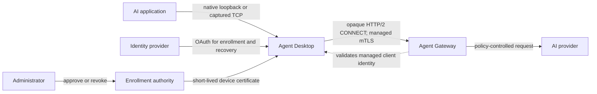
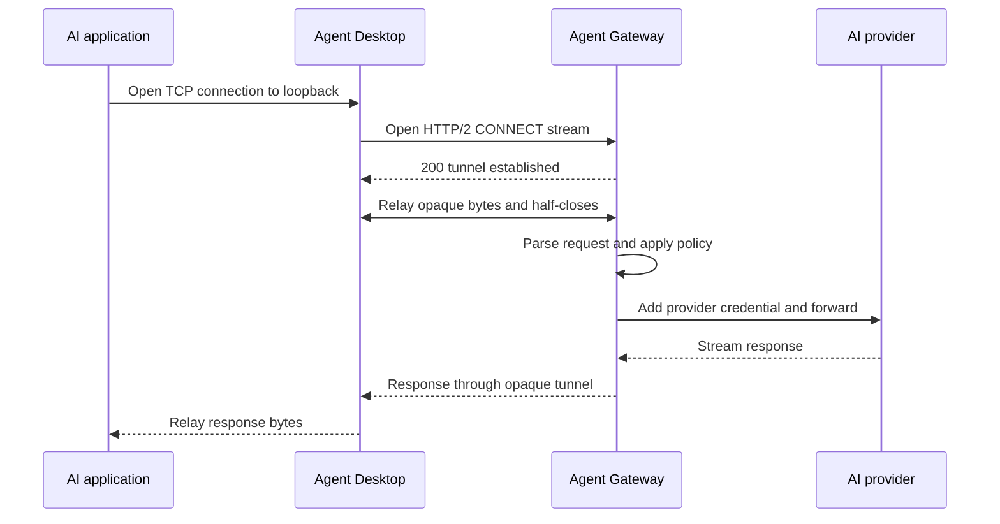
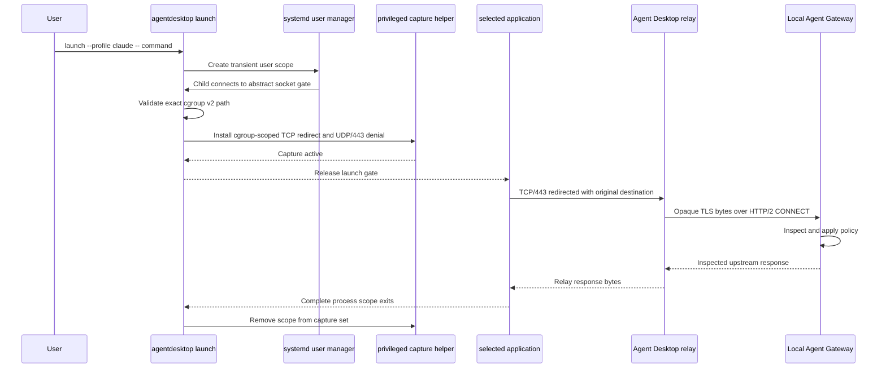
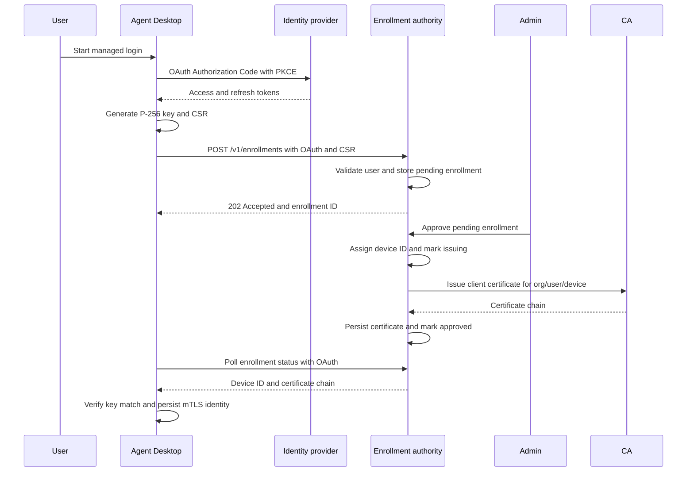
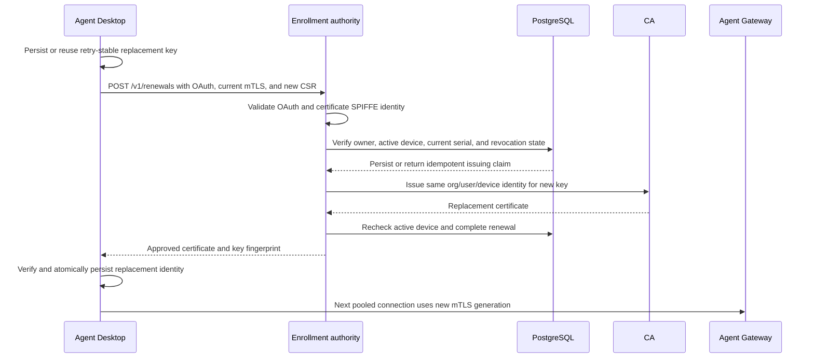
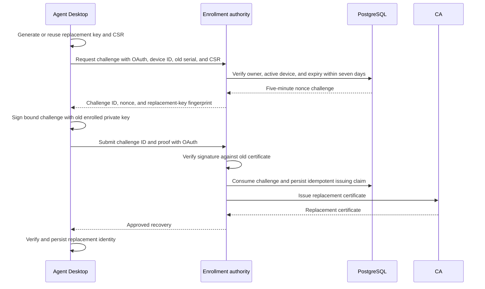

# Contributing to Agent Desktop

This guide is the technical starting point for contributors. It explains the system boundaries, important user flows, repository layout, and the quickest ways to exercise real behavior.

Before changing architecture, read [AGENTS.md](AGENTS.md). It defines the project goals, non-goals, trust boundaries, and current milestone. [Phase Status](docs/development/phase-status.md) records what has actually been validated.

## Your first hour

Start with a small, deterministic path before setting up a VM or real identity provider:

1. Read [README.md](README.md) for the product model, then the **Mental model** and **Ownership boundaries** below. The most important rule is that Agent Desktop routes and proves identity; Agent Gateway owns policy, inspection, and provider credentials.
2. Install the Rust toolchain selected by [rust-toolchain.toml](rust-toolchain.toml), then run `cargo test --all-targets`. This exercises the connector, CLI, installers, session protocol, and integration fixtures without contacting an AI provider.
3. Run `cargo run -- --help`, then trace one native flow through `src/app.rs` -> `src/service.rs` -> `src/service/forwarder.rs` -> `src/service/hbone.rs`.
4. Run the standalone container smoke test below. It is the fastest real Agent Desktop plus Agent Gateway walkthrough and returns deterministic fixture data.
5. Pick one ownership area from the repository map. Read its nearest test before changing it, and use [Phase Status](docs/development/phase-status.md) to avoid treating an implemented component as a completed end-to-end platform journey.

Good first changes are focused tests, error handling, documentation, or one platform-owned behavior. Avoid combining identity, capture, telemetry, installer, and control-plane work in one change.

### What runs where

The development topology now has two connector process roles:

- The **machine forwarder** owns application listeners, OS attribution, capture, and user-keyed HBONE pools. It must not load OAuth tokens or private keys.
- A **per-user session agent** owns OAuth, enrollment state, private-key signing, and standalone Agent Gateway registration. Linux authenticates it over a Unix socket; Windows authenticates it over a named pipe using the peer SID.

Linux native attribution uses an exact `NETLINK_SOCK_DIAG` tuple. Windows native attribution is produced by the WFP callout from flow-bound token metadata and consumed from Winsock redirect context. Missing, stale, or ambiguous attribution fails closed; do not add PID, executable-name, or TCP-table fallback.

## Mental model

Agent Desktop is a thin edge connector. It gets selected application traffic to Agent Gateway and, in managed mode, proves who the user and device are. Agent Gateway remains the only policy and content-inspection boundary.



The arrows do not imply that OAuth is sent with application traffic. Managed forwarding authenticates with the authority-issued client certificate only.

### Two independent choices

Do not conflate deployment mode with traffic path:

- **Deployment mode:** standalone local Gateway or managed remote Gateway.
- **Traffic path:** native application configuration or process-scoped capture.

The supported combinations are:

| | Native | Captured |
| --- | --- | --- |
| Standalone | Supported | Supported on Linux |
| Managed | Supported | Not implemented |

### Ownership boundaries

| Component | Owns |
| --- | --- |
| AI application | Application protocol and user interaction |
| Agent Desktop | Loopback listeners, application adapters, process scopes, OS capture, OAuth enrollment, device keys, tunnel lifecycle, and fail-closed behavior |
| Agent Gateway | AI policy, HTTP parsing, TLS inspection, provider credentials, upstream routing, and request-level audit data |
| Enrollment authority | Device approval, certificate issuance state, renewal, recovery, and revocation records |
| Identity provider | Organizational user authentication |
| MDM | Installation and bootstrap configuration in managed deployments; not runtime AI policy |

## Request paths

### Native forwarding

Native forwarding is preferred because the application explicitly targets the connector.



The connector never retries an application request after tunnel failure because it cannot know whether opaque bytes are replay-safe.

Relevant code:

- Runtime orchestration: [src/service.rs](src/service.rs)
- HTTP/2 CONNECT pool: [src/service/hbone.rs](src/service/hbone.rs)
- Opaque byte relay: [src/service/forwarder.rs](src/service/forwarder.rs)
- Claude adapter: [src/apps/claude.rs](src/apps/claude.rs)
- Per-user registration protocol: [src/session_protocol.rs](src/session_protocol.rs)
- Linux and Windows session transports: [src/session](src/session)
- Linux and Windows source attribution: [src/platform](src/platform)

### Standalone Linux capture

Capture handles applications that cannot be configured with a gateway URL.



The connector preserves the original destination and original TLS bytes. Agent Gateway alone performs policy-driven TLS interception. Capture is routed process-tree enforcement, not a filesystem sandbox or protection from a local administrator.

Relevant code and design:

- Scope and gate lifecycle: [src/launch.rs](src/launch.rs)
- Capture relay: [src/service/capture.rs](src/service/capture.rs)
- Linux platform integration: [src/platform/linux.rs](src/platform/linux.rs)
- Operational design: [docs/deployment/linux-capture.md](docs/deployment/linux-capture.md)

## Managed identity flows

### Enrollment

Enrollment binds an OAuth-authenticated user and an administrator-approved device to a connector-held P-256 key.



CSR subject and SAN fields are untrusted. The authority constructs the certificate identity from its own organization, user, and device records. The private key never leaves Agent Desktop storage.

Review in this order:

1. Connector request and status: [src/identity/enrollment/client.rs](src/identity/enrollment/client.rs)
2. HTTP authentication and validation: [control-plane/internal/api/server.go](control-plane/internal/api/server.go)
3. Enrollment state machine: [control-plane/internal/enrollment/service.go](control-plane/internal/enrollment/service.go)
4. Transactional storage: [control-plane/internal/store/postgres/store.go](control-plane/internal/store/postgres/store.go)
5. Certificate construction: [control-plane/internal/ca/x509.go](control-plane/internal/ca/x509.go)

### Certificate renewal

The connector checks every 15 minutes and renews within six hours of expiry. Normal renewal rotates the P-256 key and requires both OAuth user identity and the current valid mTLS device certificate.



The durable draft and authority claim make retries deterministic. If CA issuance has an ambiguous result, the claim remains `issuing`; reconciliation retries with the same issuance ID and time.

Review in this order:

1. Renewal scheduling and live rotation: [src/service/renewal.rs](src/service/renewal.rs)
2. Key draft and HTTP request: [src/identity/enrollment/client.rs](src/identity/enrollment/client.rs)
3. Draft persistence: [src/identity/enrollment/persistence.rs](src/identity/enrollment/persistence.rs)
4. Verified certificate identity: [control-plane/internal/deviceidentity/identity.go](control-plane/internal/deviceidentity/identity.go)
5. Renewal service and reconciliation: [control-plane/internal/renewal/service.go](control-plane/internal/renewal/service.go)
6. Database claims and completion: [control-plane/internal/store/postgres/store.go](control-plane/internal/store/postgres/store.go)
7. HBONE identity generations: [src/service/hbone.rs](src/service/hbone.rs)

### Expired-certificate recovery

An expired certificate cannot authenticate normal mTLS renewal. Recovery is a bounded fallback that combines OAuth with proof of the previously enrolled private key.



Recovery is not the normal renewal path. Valid certificates use standard mTLS; recovery adds nonce storage and custom proof verification only when certificate expiry makes mTLS unavailable.

Relevant code:

- Connector recovery: [src/identity/enrollment/client.rs](src/identity/enrollment/client.rs)
- Canonical proof and verification: [control-plane/internal/renewal/recovery.go](control-plane/internal/renewal/recovery.go)
- Recovery service: [control-plane/internal/renewal/service.go](control-plane/internal/renewal/service.go)
- Recovery database checks: [control-plane/internal/store/postgres/store.go](control-plane/internal/store/postgres/store.go)

## Repository map

```text
src/
  app.rs                     CLI dispatch and platform-visible subcommands
  main.rs                    CLI entry point
  config.rs                  Mode-specific configuration validation
  launch.rs                  Linux application scopes and launch gate
  service.rs                 Connector lifecycle orchestration
  service/                   HBONE, forwarding, capture, renewal, status
  session/                   Authenticated Linux and Windows user sessions
  session_protocol.rs        Bounded registration and external-signing frames
  identity/                  OAuth, enrollment, keys, credential storage
  apps/                      Application adapters, currently Claude Code
  platform/                  OS-native source attribution, capture, and trust
  bin/                       Installer and privileged helper binaries
windows/wfp/                 WDM/WFP native-flow producer and shared ABI
control-plane/
  internal/api/              Enrollment HTTP API
  internal/auth/             OAuth token validation
  internal/enrollment/       Enrollment and approval state machine
  internal/renewal/          Renewal and expired-certificate recovery
  internal/ca/               Certificate issuance backends
  internal/store/postgres/   Durable state transitions and audit records
docs/
  architecture/              Versioned protocol and trust contracts
  deployment/                Operator and platform runbooks
  compatibility/             Tested platform behavior
  development/               Verified phase status
examples/managed-walkthrough/ Managed development fixture
scripts/                     Builds, smoke tests, and walkthrough drivers
tests/                       Rust integration tests and Fedora VM harness
```

## Development setup

The Rust toolchain is pinned by [rust-toolchain.toml](rust-toolchain.toml). The control plane uses Go and PostgreSQL. Container walkthroughs support Podman 5+ or Docker, with Podman receiving the most coverage.

Core validation:

```bash
cargo test --all-targets
cargo fmt --check
cargo clippy --all-targets --all-features -- -D warnings
node --test tests/fixtures/fake-authorization-server.test.mjs

(cd control-plane && go test ./...)
```

Windows uses the MSVC ABI. From Linux, install `clang`, the pinned cross tool, and its Rust LLVM support, then run the repository check:

```bash
rustup target add x86_64-pc-windows-msvc
rustup component add llvm-tools
cargo install --locked cargo-xwin --version 0.23.0
./scripts/check-windows-msvc.sh
```

`cargo-xwin` downloads the Microsoft CRT and Windows SDK and therefore requires acceptance of the [Microsoft software license](https://go.microsoft.com/fwlink/?LinkId=2086102). The check compiles every library, binary, and test target for `x86_64-pc-windows-msvc` with warnings denied. It does not execute Windows binaries; runtime validation belongs in the disposable Windows VM.

The project deliberately does not support MinGW. Windows changes must compile for `x86_64-pc-windows-msvc`; driver changes additionally require the WDK environment described in [windows/wfp/README.md](windows/wfp/README.md).

PostgreSQL integration tests require `TEST_DATABASE_URL`; see [control-plane/README.md](control-plane/README.md).

Keep changes within the owning component. In particular:

- Do not add policy or HTTP parsing to the connector.
- Do not expose OAuth tokens to Agent Gateway or application traffic.
- Do not trust connector-supplied identity headers in managed mode.
- Do not add direct-provider fallback.
- Do not combine native and captured routing for one application.
- Add deterministic coverage for failure and restart behavior, not only the happy path.

## Walkthroughs

### Standalone container smoke test

This is the quickest real connector plus Agent Gateway path. It uses a deterministic response and no provider credential.

```bash
./scripts/container-up.sh smoke
./scripts/container-smoke.sh
./scripts/container-down.sh
```

To exercise a real pinned Claude Code CLI against the mock provider:

```bash
./scripts/container-claude-smoke.sh
./scripts/container-down.sh
```

To show one allowed request and one Gateway policy denial:

```bash
./scripts/container-up.sh smoke
./scripts/container-policy-smoke.sh
./scripts/container-down.sh
```

### Automated managed E2E

This is the preferred fast check for managed enrollment, administrator approval, mTLS forwarding, and revocation bookkeeping. It requires Podman 5 or newer, `curl`, `jq`, and free access to the fixture's fixed loopback ports. The first run builds or pulls several container images. It requires no arguments or input and reports success through its exit code.

```bash
scripts/managed-e2e.sh
```

The script builds the current Rust connector and Go control-plane image, drives OAuth PKCE through fixture APIs, approves enrollment, verifies an exact `SMOKE_OK` response through Agent Gateway, revokes the device, and cleans up its containers and identity state.

### Manual managed walkthrough

Use this when reviewing each API and state transition directly:

```bash
scripts/managed-walkthrough.sh start
# Follow examples/managed-walkthrough/README.md
scripts/managed-walkthrough.sh stop
```

The full commands, local trust bundle, ports, enrollment approval, connector startup, and revocation steps are in [examples/managed-walkthrough/README.md](examples/managed-walkthrough/README.md).

### Interactive Fedora user and administrator journey

Use the disposable VM to evaluate installation, browser login, administrator UI approval, Claude configuration, trust consent, and desktop behavior. The host needs QEMU, `qemu-img`, `socat`, SSH, and KVM for normal performance; the first base-image build also needs Packer and downloads the Fedora installer and package set. See [tests/vm/README.md](tests/vm/README.md) before starting.

```bash
scripts/vm-managed-walkthrough.sh prepare --reset
```

Then follow [tests/vm/README.md](tests/vm/README.md). The administrator uses the host browser while the user journey runs inside Fedora. Stop everything afterward:

```bash
scripts/vm-managed-walkthrough.sh stop
```

### Standalone Linux capture journey

The Fedora VM harness is also the authoritative environment for systemd, cgroup v2, nftables, Polkit, and trust-store behavior. Build the embedded installer and follow the installation journey in [tests/vm/README.md](tests/vm/README.md). Lower-level capture commands and isolated tests are documented in [docs/deployment/linux-capture.md](docs/deployment/linux-capture.md).

### Windows development VM

Use the disposable Windows 11 QEMU environment for native forwarding and WFP driver development. It requires a locally downloaded official Windows 11 Enterprise Evaluation ISO. See [tests/vm/windows/README.md](tests/vm/windows/README.md) for host setup and lifecycle commands.

The two checked-in Windows smokes cover different boundaries: `native-smoke.ps1` validates standalone supervision and opaque forwarding, while `wfp-smoke.ps1` validates the kernel redirect producer, exact original destination, initiating SID, one-shot configuration, and service-death fail-closed behavior. They do not yet form a complete managed Windows user journey.

## Before opening a change

Run the narrowest test for the component first, then the core checks when practical:

```bash
cargo fmt --all -- --check
cargo test --all-targets
cargo clippy --all-targets --all-features -- -D warnings
(cd control-plane && go test ./... && go vet ./...)
git diff --check
```

For Windows-facing Rust, also run `./scripts/check-windows-msvc.sh`. For kernel changes, record the WDK build, Universal validation, and relevant runtime smoke result. Document any environment-dependent test you could not run.

## Where to go deeper

- Complete product direction and constraints: [AGENTS.md](AGENTS.md)
- Current verified implementation: [docs/development/phase-status.md](docs/development/phase-status.md)
- Managed certificate trust contract: [docs/architecture/managed-mtls-v1.md](docs/architecture/managed-mtls-v1.md)
- HBONE wire contract: [docs/architecture/hbone-connect-v1.md](docs/architecture/hbone-connect-v1.md)
- Enrollment service operations: [control-plane/README.md](control-plane/README.md)
- Standalone operations: [docs/deployment/standalone.md](docs/deployment/standalone.md)
- Platform compatibility: [docs/compatibility/platforms.md](docs/compatibility/platforms.md)