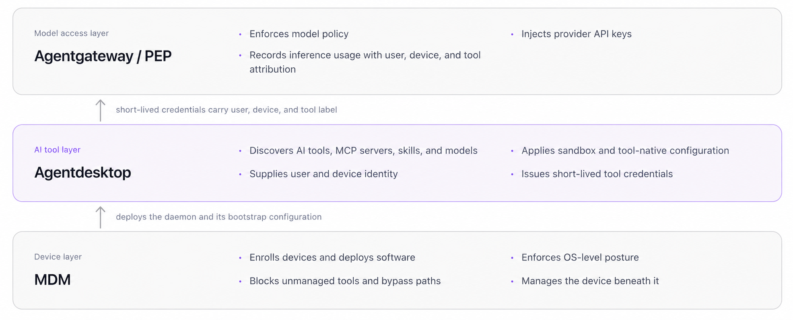
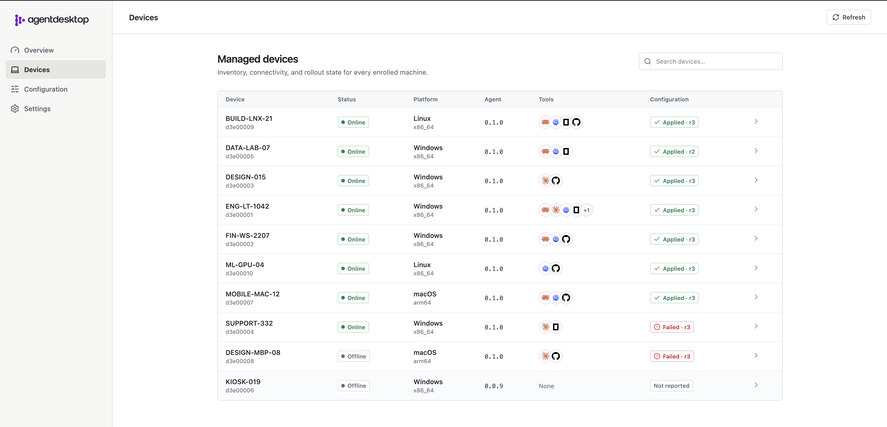

<picture>
  <source media="(prefers-color-scheme: dark)" srcset="images/logo-light.svg">
  
</picture>

# Open-source visibility and control for AI tools across your desktop fleet

[](https://github.com/agentdesktop-dev/agentdesktop/actions/workflows/ci.yml)
[](https://github.com/agentdesktop-dev/agentdesktop/releases/latest)
[](LICENSE)
[](https://github.com/agentdesktop-dev/agentdesktop)
[](https://discord.com/invite/uKX2FvCVpS)

Agentdesktop discovers AI developer tools, inventories MCP servers and skills,
applies tool-native configuration and sandbox policy, and connects each device
to an LLM gateway with user and device identity.

Keep developers in Claude Code, Codex, OpenCode, and VS Code while giving
platform teams one place to understand and manage the fleet.

[Website](https://agentdesktop.dev) ·
[Documentation](https://agentdesktop.dev/docs/) ·
[Announcement](https://agentdesktop.dev/blog/2026/09/introducing-agentdesktop/) ·
[Releases](https://github.com/agentdesktop-dev/agentdesktop/releases)

## Why Agentdesktop?

AI agents increasingly run on employee workstations, but the controls around
them are fragmented across tool-specific settings, MCP connections, skills,
provider credentials, and local configuration files.

MDM remains the right layer for enrolling devices, deploying software, and
enforcing OS posture. Agentdesktop adds the AI-tool-aware layer above it.

| See what is running | Manage tools natively | Control model access |
| --- | --- | --- |
| Discover supported tools and versions, then inventory MCP servers, skills, and models without collecting their secrets or contents. | Define configuration and sandbox intent once. Agentdesktop translates it into each supported tool's native format and reports whether it was applied. | Route tools through your LLM gateway with short-lived credentials carrying user, device, and allowed client context. Provider API keys remain at the gateway. |



## Start on one workstation

Try the same endpoint daemon used in a managed fleet without deploying a
controller.

### 1. Install Agentdesktop

Download the current device binary from
[GitHub Releases](https://github.com/agentdesktop-dev/agentdesktop/releases), or
build it from source:

```sh
git clone https://github.com/agentdesktop-dev/agentdesktop.git
cd agentdesktop
corepack enable
make install
```

### 2. Preview the standalone example

The repository includes a working standalone configuration for Claude Code,
OIDC, and Agentgateway. Preview every proposed file action without changing
tool configuration:

```sh
agentdesktop daemon \
  --config examples/standalone/config.yaml \
  --user \
  --dry-run
```

### 3. Run and inspect

Remove `--dry-run` to reconcile the configuration and leave the daemon
running:

```sh
export ANTHROPIC_API_KEY=sk-ant-...
docker compose -f examples/standalone/compose.yaml up -d

agentdesktop daemon \
  --config examples/standalone/config.yaml \
  --user
```

In another terminal, check the daemon and list discovered tools and models:

```sh
agentdesktop status
agentdesktop discover
```

The desktop and fleet interfaces also expose the MCP server and skill
inventory. See the [standalone quickstart](https://agentdesktop.dev/docs/getting-started/standalone/)
for prerequisites, test credentials, and a walkthrough of the local services.

## Start locally, grow into a fleet

Agentdesktop uses the same daemon and tool-native configuration model at every
stage.

| Standalone | Controller-managed |
| --- | --- |
| Read policy from local YAML, discover and configure tools on one workstation, and authenticate the user directly to a compatible LLM gateway. No controller or device identity is required. | Centrally inventory a fleet, distribute versioned configuration, enroll users and devices, report reconciliation status, and issue short-lived gateway credentials. |
| [Run the standalone quickstart](https://agentdesktop.dev/docs/getting-started/standalone/) | [Run the managed quickstart](https://agentdesktop.dev/docs/getting-started/managed/) |



## Core capabilities

- **AI tool discovery:** detect supported developer tools and their versions
  across Linux, macOS, and Windows.
- **Secret-minimizing inventory:** report configured MCP servers and skills
  without collecting MCP command arguments, environment variables, HTTP
  headers, or skill bodies.
- **Tool-native configuration:** safely merge managed values into the formats
  expected by each tool while preserving unrelated user settings.
- **Shared sandbox policy:** translate filesystem and network restrictions into
  the native sandbox configuration supported by Claude Code and Codex.
- **User and device identity:** bind a locally generated device key and
  certificate to the user who enrolled the workstation through OIDC.
- **Runtime credentials:** give supported tools short-lived credentials instead
  of distributing long-lived provider keys to workstations.
- **Identity-aware gateway integration:** attach user, device, and allowed client
  context for gateway routing, policy, logging, and usage attribution.
- **Opt-in telemetry:** collect selected session and tool-use events when an
  organization enables them.

## Supported tools

| Tool | Discovery | Managed configuration | MCP and skills inventory | Sandbox policy |
| --- | --- | --- | --- | --- |
| Claude Code | Yes | Yes | MCP and skills | Yes |
| Claude Desktop | Yes | Yes | MCP | — |
| Codex | Yes | Yes | MCP and skills | Yes |
| OpenCode | Yes | Yes | MCP | — |
| VS Code | Yes | — | MCP and skills | — |

> **Don't see your tool?** We're actively expanding this list and would love
> your help. [Open an integration request](https://github.com/agentdesktop-dev/agentdesktop/issues/new)
> to tell us what you use, or contribute discovery and configuration support
> for another AI developer tool or harness.

The project targets Linux, macOS, and Windows. Support varies where a tool or
operating system does not expose an equivalent native configuration surface.

## How it works

The daemon runs on each workstation and reconciles developer-tool
configuration. It can receive desired configuration from the controller or
read the same YAML directly in standalone mode. Managed tools continue to run
locally and can request credentials for an LLM gateway through the daemon.


In controller-managed mode, the daemon generates its private device key on the
workstation and sends only a certificate signing request to the controller.
After enrollment, protected controller operations require the device
certificate and a valid token for the user who enrolled it.

When a supported tool requests gateway access, the controller can issue a
short-lived JWT containing the user, device ID, allowed client label, audience,
issuer, and expiry. The client label is asserted by the local helper; it is
useful for policy and attribution, but it is not cryptographic proof of the
calling executable.

Read the [announcement](https://agentdesktop.dev/blog/2026/09/introducing-agentdesktop/)
for a deeper walkthrough of standalone mode, enrollment, and short-lived tool
credentials.

## Project and community

Agentdesktop is fully open source under the [Apache License 2.0](LICENSE).

- Read the [documentation](https://agentdesktop.dev/docs/).
- Browse or report [issues](https://github.com/agentdesktop-dev/agentdesktop/issues).
- Help us [add support for another AI developer tool](https://github.com/agentdesktop-dev/agentdesktop/issues/new).
- Review the [Code of Conduct](CODE_OF_CONDUCT.md) before contributing.
- See the [production guide](https://agentdesktop.dev/docs/operations/production/)
  for Kubernetes, certificates, MDM, and endpoint enrollment.

<!-- markdownlint-disable-file first-line-heading no-inline-html -->
