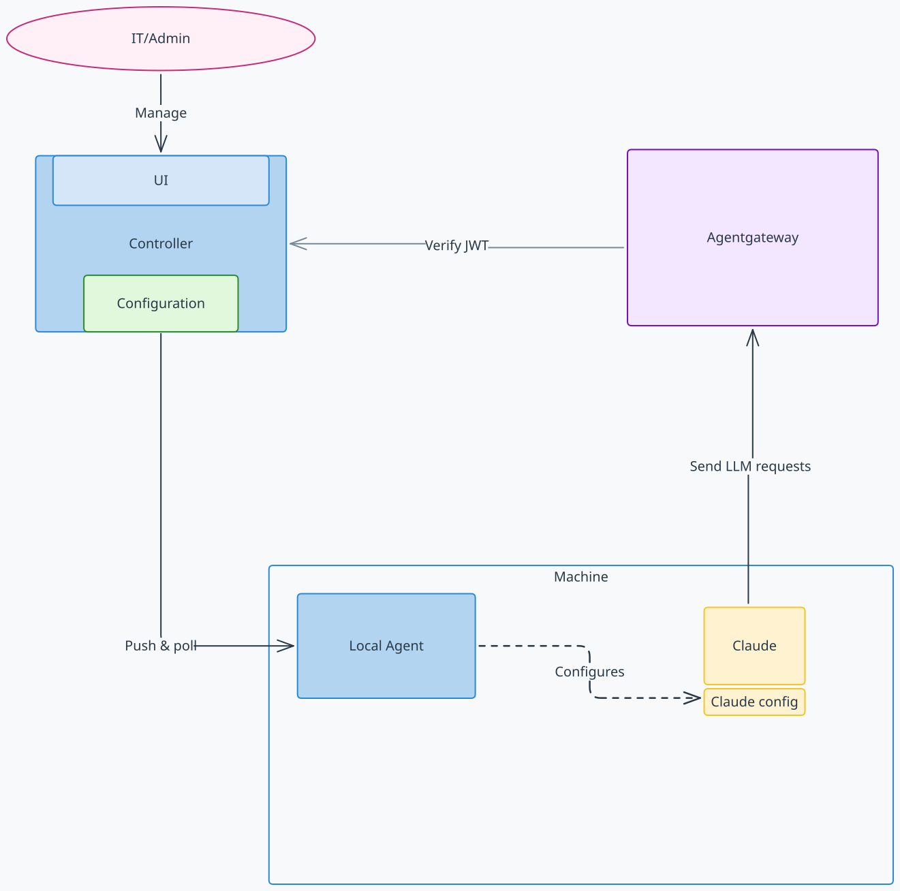

<p align="center">
  
</p>

# Agentdesktop

**The open-source control plane for AI developer tools.**

MDM can install applications and push files. Agentdesktop manages the agent
layer: which tools are running, what they can connect to, how they are
configured, who is using them, and what they are doing.

Agentdesktop brings discovery, policy, identity, gateway access, and telemetry
into one fully open-source system. Keep developers in Claude, Codex, OpenCode,
and VS Code while giving platform teams a fleet-wide management experience
built for AI agents - not retrofitted from device management scripts.

## What you can do

- See which AI agents are installed on each device, including their versions.
- Inventory MCP servers and skills without collecting MCP credentials, command
  arguments, environment variables, or skill bodies.
- Configure a shared inference gateway to send agent traffic through.
- Enroll devices through OIDC and associate them with the signed-in user.
- Issue short-lived controller-signed JWTs for an inference gateway such as
  Agentgateway.
- Collect selected events such as new sessions and tool use.

## Fleet management UI

Inspect device health, configuration state, recent agent activity, installed
tools, MCP servers, and skills from one local management console.


## Supported tools

| Tool | Discovery | Managed configuration | MCP and skills |
| --- | --- | --- | --- |
| Claude Code | Yes | Yes | MCP and skills |
| Claude Desktop | Yes | Yes | MCP |
| Codex | Yes | Yes | MCP and skills |
| OpenCode | Yes | Yes | MCP |
| VS Code | Yes | Not yet | — |

Agentdesktop targets Linux, macOS, and Windows.

## Architecture

The daemon runs on each device and reconciles developer-tool configuration. It
can receive desired configuration from the controller, or read the same YAML
directly in standalone mode. Developer tools continue to run locally and can
request short-lived credentials for the inference gateway through the daemon.



## Get started

Choose the setup that fits your environment:

- [Standalone mode](./examples/standalone) reads local YAML and can authenticate
  directly to an inference gateway with OIDC. It needs no controller or device
  identity.
- [Controller-managed Claude Code](./examples/claude) runs the complete local
  fleet-management example with OIDC enrollment and Agentgateway.

## Configuration

The controller can distribute daemon configuration to connected devices, or a
standalone daemon can apply it from a local file.

A small configuration can manage a shared gateway, telemetry, and agents. For example:

```yaml
inferenceGateway:
  url: https://gateway.example.com
  authentication:
    type: controllerJwt
    audience: agentgateway
    allowedClientIds: [claude-code, claude-desktop, codex, opencode]

telemetry:
  events:
  - session.new
  - tool.use

programs:
  claudeCode:
    permissions:
      defaultMode: plan
    companyAnnouncements: ["Managed by Agentdesktop"]
  claudeDesktop:
    isLocalDevMcpEnabled: true
```

For a controller-free setup, omit `controller` and configure OIDC directly:

```yaml
inferenceGateway:
  url: https://gateway.example.com
  authentication:
    type: oidc
    issuer: https://login.example.com
    clientId: agentdesktop

programs:
  claudeCode: {}
  codex: {}
```

Save this as `~/.config/agentdesktop/config.yaml`, register
`http://127.0.0.1:5555/callback` with the OIDC provider, and run:

```sh
agentdesktop daemon --user
```

The daemon opens the browser for sign-in when it starts. `--user` stores daemon
state in your home directory and manages user-level tool settings. For Claude
Code, Agentdesktop merges its values into `~/.claude/settings.json` and preserves
unrelated settings. Explicit path options shown by `agentdesktop daemon --help`
override the defaults.

Use `--dry-run` to preview file actions without writing anything; an unsafe
target is reported as a `conflict` instead of failing the preview. Use `--once`
to apply static settings once and exit; controller connectivity, telemetry, and
authenticated gateways require the daemon to remain running.

## Enrollment and identity

Controller-managed devices are enrolled through a dual-authentication scheme.
A private key is bound to a device and never leaves that device. The public key
is used to authenticate the device to the controller.

OIDC also authenticates the device user. Standalone mode uses a simpler native
OIDC flow and sends the resulting access token directly to the configured
inference gateway; it creates no device key or certificate.


## Telemetry

Selected events from agents on managed devices, such as tool use and session
creation, can be reported to the controller. Telemetry is opt-in.

## Project policy

Agentdesktop is available under the [Apache License 2.0](LICENSE). Please read
the [Code of Conduct](CODE_OF_CONDUCT.md) before participating.
