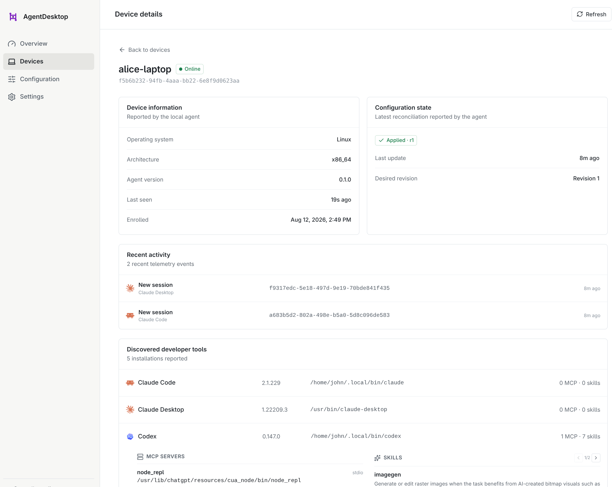
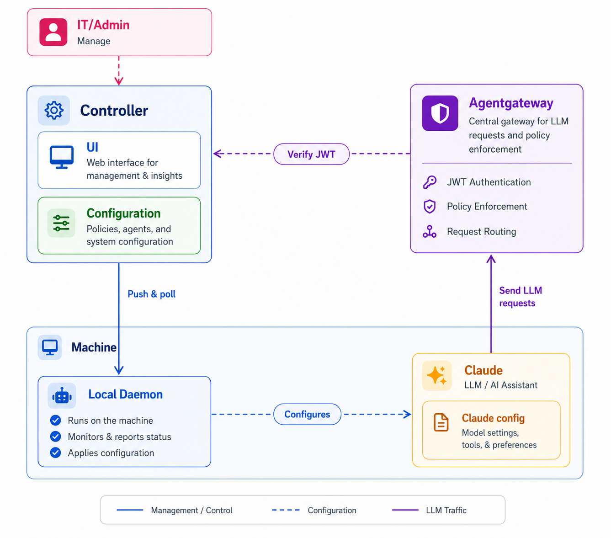

# agentdesktop


**The open-source control plane for AI developer tools.**

MDM manages the device, but each AI developer tool has its own settings, MCP
connections, skills, and gateway configuration. agentdesktop manages those
tools as a fleet: see what is installed, apply managed configuration, and
connect each device to your LLM gateway.

agentdesktop brings discovery, policy, identity, gateway access, and telemetry
into one fully open-source system. Keep developers in Claude, Codex, OpenCode,
and VS Code while giving platform teams a fleet-wide management experience
built for AI developer tools, not retrofitted from device management scripts.

[Website](https://agentdesktop.dev) ·
[Documentation](https://agentdesktop.dev/docs/) ·
[Releases](https://github.com/agentdesktop-dev/agentdesktop/releases)

## What you can do

- See which AI developer tools are installed on each device and their versions.
- Inventory MCP servers and skills without collecting MCP command arguments,
  environment variables, HTTP headers, or skill bodies.
- Preview and reconcile managed settings for supported tools.
- Connect supported tools directly to a shared LLM gateway.
- Enroll devices through OIDC and associate them with the signed-in user.
- Issue short-lived controller-signed JWTs for an LLM gateway such as
  agentgateway.
- Collect selected session and tool-use events when telemetry is enabled.

## Fleet management UI

Inspect device health, configuration state, recent agent activity, installed
tools, MCP servers, and skills from the fleet management UI.



## Supported tools

| Tool | Discovery | Managed configuration | MCP and skills |
| --- | --- | --- | --- |
| Claude Code | Yes | Yes | MCP and skills |
| Claude Desktop | Yes | Yes | MCP |
| Codex | Yes | Yes | MCP and skills |
| OpenCode | Yes | Yes | MCP |
| VS Code | Yes | Not yet | Not yet |

The project targets Linux, macOS, and Windows.

## Architecture

The daemon runs on each device and reconciles developer-tool configuration. It
can receive desired configuration from the controller, or read the same YAML
directly in standalone mode. Developer tools continue to run locally and can
request short-lived credentials for the LLM gateway through the daemon.



## Get started

Start with [Build and install](https://agentdesktop.dev/docs/getting-started/build/)
when working from source, then choose the setup that fits your environment:

- [Standalone mode](https://agentdesktop.dev/docs/getting-started/standalone/)
  reads local YAML and can authenticate directly to an LLM gateway with
  OIDC. It needs no controller or device identity. The repository includes a
  [local standalone example](./examples/standalone).
- [Controller-managed mode](https://agentdesktop.dev/docs/getting-started/managed/)
  enrolls users and devices, distributes versioned configuration, and can issue
  short-lived gateway JWTs. The [local managed example](./examples/claude) uses
  Dex and agentgateway.
- [Production deployment](https://agentdesktop.dev/docs/operations/production/)
  covers Kubernetes, certificates, MDM, and endpoint enrollment. The
  [Kubernetes example](./examples/kubernetes) includes development Dex and
  PostgreSQL dependencies.

## Configuration

The controller can distribute daemon configuration to connected devices, or a
standalone daemon can apply it from a local file.

A small configuration can manage a shared gateway, telemetry, and agents. For example:

```yaml
llmGateway:
  url: https://gateway.example.com
  authentication:
    type: controllerJwt
    audience: agentgateway
    allowedClientIds: [claude-code, claude-desktop, codex, opencode]

telemetry:
  events:
  - session.new
  - tool.use

programs:
  claudeCode:
    permissions:
      defaultMode: plan
    companyAnnouncements: ["Managed by Agentdesktop"]
  claudeDesktop:
    isLocalDevMcpEnabled: true
```

For a controller-free setup, omit `controller` and configure OIDC directly:

```yaml
llmGateway:
  url: https://gateway.example.com
  authentication:
    type: oidc
    issuer: https://login.example.com
    clientId: agentdesktop

programs:
  claudeCode: {}
  codex: {}
```

Save this as `~/.config/agentdesktop/config.yaml`, register
`http://127.0.0.1:51327/callback` with the OIDC provider, and run:

```sh
agentdesktop daemon --user
```

The daemon opens the browser for sign-in when it starts. `--user` stores daemon
state in your home directory and manages user-level tool settings. For Claude
Code, agentdesktop merges its values into `~/.claude/settings.json` and preserves
unrelated settings. Explicit path options shown by `agentdesktop daemon --help`
override the defaults.

Use `--dry-run` to preview file actions without writing anything; an unsafe
target is reported as a `conflict` instead of failing the preview. Use `--once`
to apply static settings once and exit; controller connectivity, telemetry, and
authenticated gateways require the daemon to remain running.

## Enrollment and identity

Controller-managed devices are enrolled through a dual-authentication scheme.
A private key is bound to a device and never leaves that device. The public key
is used to authenticate the device to the controller.

OIDC also authenticates the device user. Standalone mode uses a simpler native
OIDC flow and sends the resulting access token directly to the configured
LLM gateway; it creates no device key or certificate.

## Telemetry

Selected events from agents on managed devices, such as tool use and session
creation, can be reported to the controller. Telemetry is opt-in.

## Project policy

Agentdesktop is available under the [Apache License 2.0](LICENSE). Please read
the [Code of Conduct](CODE_OF_CONDUCT.md) before participating.
