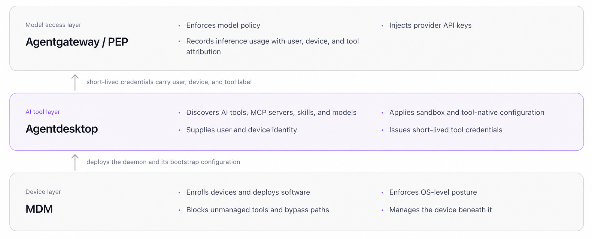
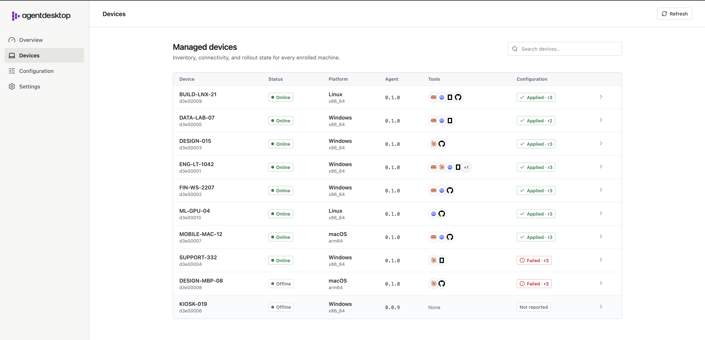
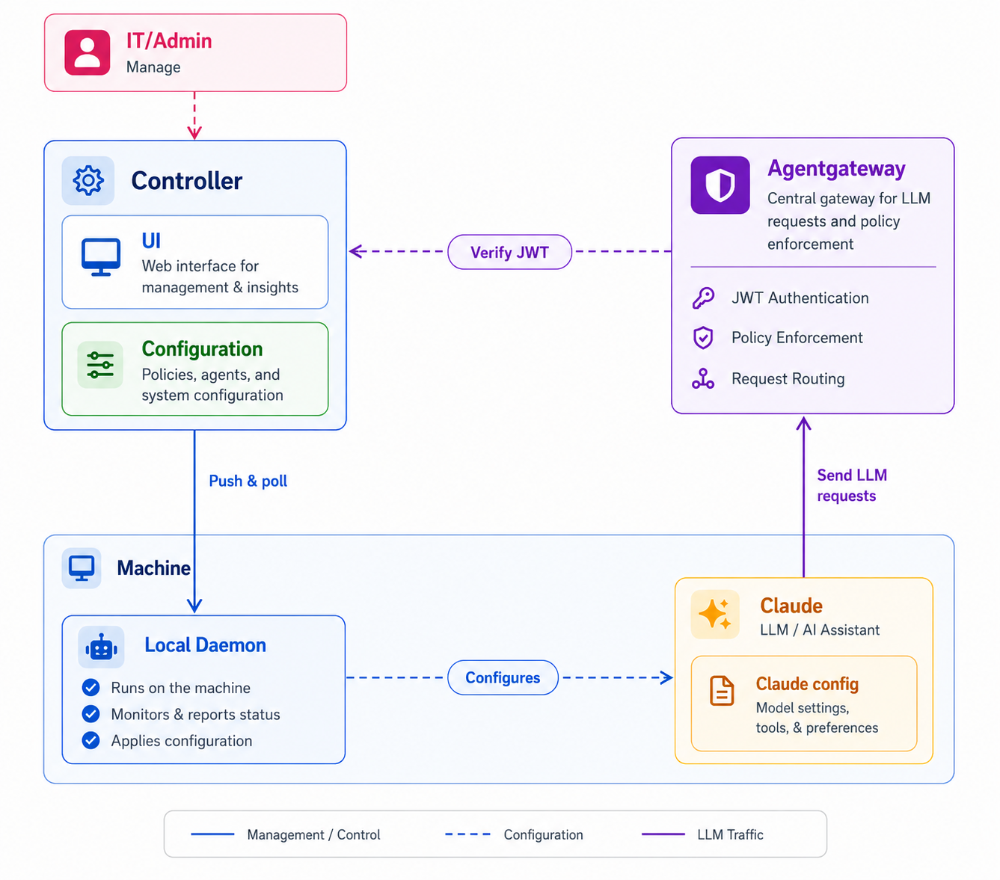

<picture>
  <source media="(prefers-color-scheme: dark)" srcset="images/logo-light.svg">
  
</picture>

# Open-source visibility and control for AI tools across your desktop fleet

[](https://github.com/agentdesktop-dev/agentdesktop/actions/workflows/ci.yml)
[](https://github.com/agentdesktop-dev/agentdesktop/releases/latest)
[](LICENSE)
[](https://github.com/agentdesktop-dev/agentdesktop)
[](https://discord.com/invite/uKX2FvCVpS)

Agentdesktop discovers AI developer tools, inventories MCP servers and skills,
applies tool-native configuration and sandbox policy, and connects each device
to an LLM gateway with user and device identity.

Keep developers in Claude Code, Codex, Cursor, OpenCode, VS Code, and Grok Build
while giving platform teams one place to understand and manage the fleet.

[Website](https://agentdesktop.dev) ·
[Documentation](https://agentdesktop.dev/docs/) ·
[Announcement](https://agentdesktop.dev/blog/2026/09/introducing-agentdesktop/) ·
[Releases](https://github.com/agentdesktop-dev/agentdesktop/releases)

## Why Agentdesktop?

AI agents increasingly run on employee workstations, but the controls around
them are fragmented across tool-specific settings, MCP connections, skills,
provider credentials, and local configuration files.

MDM remains the right layer for enrolling devices, deploying software, and
enforcing OS posture. Agentdesktop adds the AI-tool-aware layer above it.

| See what is running | Manage tools natively | Control model access |
| --- | --- | --- |
| Discover supported tools and versions, then inventory MCP servers, skills, and models without collecting their secrets or contents. | Define configuration and sandbox intent once. Agentdesktop translates it into each supported tool's native format and reports whether it was applied. | Route tools through your LLM gateway with short-lived credentials carrying user, device, and allowed client context. Provider API keys remain at the gateway. |



## Start on one workstation

Try the same endpoint daemon used in a managed fleet without deploying a
controller.

### 1. Install Agentdesktop

Download the current device binary from
[GitHub Releases](https://github.com/agentdesktop-dev/agentdesktop/releases), or
build it from source:

```sh
git clone https://github.com/agentdesktop-dev/agentdesktop.git
cd agentdesktop
corepack enable
make install
```

### 2. Preview the standalone example

The repository includes a working standalone configuration for Claude Code,
OIDC, and Agentgateway. Preview every proposed file action without changing
tool configuration:

```sh
agentdesktop daemon \
  --config examples/standalone/config.yaml \
  --user \
  --dry-run
```

### 3. Run and inspect

Remove `--dry-run` to reconcile the configuration and leave the daemon
running:

```sh
export ANTHROPIC_API_KEY=sk-ant-...
docker compose -f examples/standalone/compose.yaml up -d

agentdesktop daemon \
  --config examples/standalone/config.yaml \
  --user
```

In another terminal, check the daemon and list discovered tools and models:

```sh
agentdesktop status
agentdesktop discover
```

The desktop and fleet interfaces also expose the MCP server and skill
inventory. See the [standalone quickstart](https://agentdesktop.dev/docs/getting-started/standalone/)
for prerequisites, test credentials, and a walkthrough of the local services.

## Local LLM proxy

For clients without an API-key helper, enable the daemon's optional loopback proxy
in the local configuration file (startup settings are local only, not delivered by
the controller). The proxy is available in `--user` mode only: it hands out the
current user's gateway credential, so a system daemon rejects
`daemon.llmProxy.listen`. If the address cannot be bound at startup, the daemon
keeps running without the proxy and reports `llmProxy.bound: false` with the
reason in daemon-info (the desktop app's "Daemon information" panel, or
`curl --unix-socket <socket> http://localhost/v1/daemon-info`). If the proxy
stops later, the daemon also keeps running; that is only visible in the daemon
log until the next restart:

```yaml
daemon:
  llmProxy:
    listen: 127.0.0.1:4000
```

Then start the daemon as usual:

```sh
agentdesktop daemon --user --config <your-config>.yaml
```

Point the client's model endpoint at `http://127.0.0.1:4000/v1/chat/completions`,
`/v1/messages`, or `/v1/responses`, according to the protocol it uses, and give it
the pairing header (see **Pairing** below). The proxy forwards request bodies
(buffered, see below) to `llmGateway.proxyUrl` (or `llmGateway.url` when unset),
streams the response back, and adds the credential from the same authentication
flow used by the daemon's API-key helpers. Login and refresh stay with the
existing authentication implementation. No client API key is needed. Incoming
authorization/API-key headers are replaced, and upstream HTTP errors and
redirects are passed back without following redirects.

The incoming path and query are appended to the gateway base URL: with
`llmGateway.proxyUrl: https://gateway.example/prefix` (or `url`, when `proxyUrl`
is unset), `/v1/messages` goes to `https://gateway.example/prefix/v1/messages`.
Avoid repeating `/v1` in both URLs.

**Without the proxy.** When the daemon runs without its loopback proxy
(`daemon.llmProxy.listen` unset, or the address could not be bound),
`llmGateway.whenProxyUnavailable` decides what happens to the files of the
programs that use the proxy (`programs.copilot`, `programs.vscode`). With
`failClosed`, the default, the daemon leaves their managed entries as they
are: the Copilot CLI and VS Code stay pointed at the loopback port, and those
requests fail instead of reaching GitHub past the gateway. If the address could
not be bound because another process holds it, that process receives those
requests, with VS Code's Copilot tokens and the pairing value: use the default
on devices with a single user, as for the proxy in general. With
`failOpen`, the daemon removes the entries until the proxy is back: VS Code on
GitHub's models then talks to GitHub directly, and the Copilot CLI and VS Code
on own models lose the gateway's models. Either way the programs report
`inactive` with the reason, and the next apply with the proxy writes the
current entries. A stopped daemon changes no file, so the tools fail until it
runs again, whatever the policy. The policy covers only the files the daemon
writes: whether developers can reach GitHub's models without the gateway is
set by the organisation's Copilot policy and egress rules. Set the key only
after the controller and the daemons run a version that knows it; older ones
reject a configuration that carries it.

```yaml
llmGateway:
  url: https://gateway.example.com
  whenProxyUnavailable: failOpen   # default failClosed
```
The proxy does not discover models or rewrite model IDs; configure those in the
client. VS Code's built-in **Custom Endpoint** provider can use this endpoint
without the experimental extension in `vscode/`. The provider reads
`chatLanguageModels.json` in the VS Code user directory (on Linux
`~/.config/Code/User/`); keep the file owner-only, since it carries the pairing
value. Give it the pairing value in the model's `requestHeaders` (the file's
`apiKey` is not sent reliably without an OS keyring):

```json
[
  {
    "name": "agentdesktop",
    "vendor": "customendpoint",
    "apiKey": "unused",
    "apiType": "chat-completions",
    "models": [
      { "id": "gpt-4.1-mini", "name": "gpt-4.1-mini (agentdesktop)",
        "url": "http://127.0.0.1:4000/v1/chat/completions",
        "toolCalling": true, "vision": false,
        "maxInputTokens": 128000, "maxOutputTokens": 16000,
        "requestHeaders": { "x-agentdesktop-pairing": "<value>" } }
    ]
  }
]
```

Upgrade note: before the pairing existed, this route accepted any local caller.
A manual setup made against that version now gets `403 pairing_invalid` until
the header is added.

Controller JWT authentication uses client ID `vscode` by default on the
prefix-less route; choose another ID with `daemon.llmProxy.clientId`. Every client
ID the proxy presents (`vscode` or your choice, plus `copilot-cli` and
`vscode-copilot` for the routes below) must be in the controller's
`allowedClientIds`. With `authentication.type: oidc` the client ID has no effect: the
OIDC token is the same for every route. The listen address must be loopback.

**Routes.** Besides the prefix-less route (the manual shape used above, with the
credential mode from `llmGateway.githubOAuth` and the upstream from
`llmGateway.proxyUrl`), the proxy serves fixed path prefixes for the managed
Copilot programs, one per program route, so the client ID is decided by the file
the daemon writes and never by request headers. The prefix is stripped before
forwarding. A path whose first segment looks like a route name without matching
one exactly is refused with `404 route_unknown` rather than served as the
prefix-less route; this also applies to a gateway sub-path that happens to start
with a route name (for example `/vscode-copilot-proxy/...`), so do not use such
paths on the prefix-less route:

| Prefix | Client ID | Sends upstream | Upstream |
| --- | --- | --- | --- |
| `/copilot-cli/` | `copilot-cli` | gateway identity only | `llmGateway.url` |
| `/vscode-copilot/` | `vscode-copilot` | gateway identity only | `llmGateway.url` |
| `/vscode-copilot-passthrough/` | `vscode-copilot` | gateway identity in `Authorization`, the client's own bearer token in `x-llm-token` | `llmGateway.proxyUrl` (required) |
| `/vscode-copilot-capi/<pairing>/` | `vscode-copilot` | as the pass-through route; a credential-less `GET /_ping` is forwarded without `x-llm-token`; the only route that tunnels WebSocket upgrades | `llmGateway.proxyUrl` (required) |

**Pairing.** Every route requires the per-device pairing value in the
`x-agentdesktop-pairing` header, except `/vscode-copilot-capi/`, which takes it
as the first path segment after the prefix (VS Code cannot add a header there)
and ignores the header. The daemon creates it in its state directory
(`llm-proxy-pairing`, owner-only) on first use and keeps it across restarts; a
manual setup copies it from there. The state directory in `--user` mode is
`$XDG_STATE_HOME/agentdesktop`, by default `~/.local/state/agentdesktop` (the
home directory from `HOME` or `USERPROFILE`, on every platform), unless
`daemon.stateDir` says otherwise. The Copilot CLI's
`providers.json` carries it as `"headers": {"x-agentdesktop-pairing": "<value>"}`
on the provider entry. It keeps other local users on a shared host
and browser pages off the proxy, provided the client files that carry it are
owner-only too. It does not restrict the current user's own processes, which can
obtain a credential from the daemon directly. If the value cannot be created the
proxy stays off, reported in daemon-info like a failed bind.

**Requests.** `Host` must be a loopback address; `Origin`, `CONNECT` and
`OPTIONS` are refused; `..` path segments are refused. Request bodies are
buffered (32 MiB cap) so a request can be sent once more with a fresh
credential when the gateway rejects a cached one with 401 (only when no client
token was forwarded); responses stream as they arrive, with a 600 s limit on
the response headers and no total limit on the body; a non-streaming completion
sends nothing until it is done, so the header limit bounds it too. A WebSocket
tunnel on `/vscode-copilot-capi/` is outside the header limit: it runs until a
side closes it or the gateway credential used at the upgrade expires, so a
tunnel outlives a revocation or logout for up to that credential's lifetime.
A WebSocket upgrade on any other route is refused with `400
upgrade_not_supported`; other `Upgrade` tokens are stripped and the request is
forwarded as plain HTTP.
Controller-issued credentials are cached in the daemon for at most 60 s per
client ID, and are not used within 30 s of their own expiry, nor after a logout
or re-enrollment. Concurrent requests that find no cached credential share one
controller fetch; its credential is cached as soon as it arrives and dropped
again if the gateway rejects it. The cache adds no exposure beyond the credential's own
lifetime: a token the controller has issued stays valid at the gateway until it
expires whether or not the daemon caches it, and a logout does not revoke it.
OIDC credentials are not cached. A controller that does not answer within 15 s
fails the request with `agentdesktop_credential`; an OAuth refresh in flight
ahead of the controller call is not cut off, so its result is saved. When a
client token is forwarded (pass-through, or `githubOAuth.source: request`) a
401 is returned as is and the cached gateway credential is kept. With the one
retry, the worst case for one request is the header limit (600 s), a credential
fetch (20 s) and a second header limit. Refused and failed requests
return an OpenAI-style JSON body, `{"error": {"message", "type", "code"}}`, so the
LLM clients display the message. Codes: `host_not_allowed`, `pairing_invalid`,
`browser_not_allowed`, `method_not_allowed`, `path_invalid`, `route_unknown`,
`client_credential_missing`, `upgrade_not_supported`, `body_too_large`,
`body_invalid`, `agentdesktop_credential` (no gateway credential for this device: not enrolled,
revoked, controller unreachable or slow), `agentdesktop_unavailable`,
`gateway_unreachable`, `gateway_timeout`.

To attach the local user's GitHub App OAuth token as well, add the App's client ID
to the gateway configuration (keep the existing `authentication` block):

```yaml
llmGateway:
  url: https://gateway.example
  authentication:
    type: oidc
    issuer: https://login.microsoftonline.com/YOUR_TENANT/v2.0
    clientId: YOUR_ENTRA_CLIENT_ID
  githubOAuth:
    clientId: YOUR_GITHUB_APP_CLIENT_ID
```

Enable **Device Flow** in the GitHub App settings. With the proxy enabled, the
daemon opens an Agentdesktop sign-in page with a copyable code and a link to
GitHub. GitHub opens in another tab; the Agentdesktop page automatically shows
success or failure when authorization finishes. The client ID is configurable; no App client secret is
needed. The App's permissions and the user's Copilot access must permit the
upstream requests. This flow currently targets GitHub.com.

The proxy sends `Authorization: Bearer <gateway identity token>` and
`x-llm-token: <GitHub access token>`. Incoming values for both are discarded on
this route (with `githubOAuth.source: request`, and on the pass-through route,
the client's own token is what goes into `x-llm-token`).
The GitHub access and refresh tokens are stored in the daemon's existing secret
store, separately for each App client ID. Expiring tokens refresh automatically,
including refresh-token rotation; expired/rejected refresh credentials trigger
device authorization again. Non-expiring App user tokens are also supported.
Request bodies remain untouched. The existing Claude credential-helper flow is
unchanged; the local proxy always uses the gateway identity in `Authorization`.

### GitHub Copilot: a runnable example

[`examples/copilot`](examples/copilot/README.md) runs Dex and Agentgateway
locally and walks through the Copilot CLI, VS Code on the gateway's models and
VS Code on GitHub's models, with what to check at each step (drift,
conflicts, removal) and the settings the GitHub organisation owner controls
([`examples/copilot/github-side.md`](examples/copilot/github-side.md)).

### Managed program: GitHub Copilot CLI

`programs.copilot` makes the daemon write the Copilot CLI's BYOK provider
registry so the CLI talks to the proxy's `/copilot-cli` route with client ID
`copilot-cli`; nothing is edited by hand. User mode only (the file lives in the
user's Copilot directory), and it needs `daemon.llmProxy.listen`, a configured
`llmGateway`, and `copilot-cli` in `allowedClientIds`:

```yaml
programs:
  copilot:
    models:
      gpt-4.1:                    # the name the CLI shows: --model agentdesktop/gpt-4.1
        wireModel: gpt-4.1-mini   # what is sent to the gateway (defaults to modelId, which defaults to the key)
      claude-haiku-4.5:
        provider: agentdesktop-anthropic
        wireModel: claude-haiku-4-5
```

The file is `providers.json` in `$COPILOT_HOME` (default `~/.copilot`), or the
path in `COPILOT_PROVIDERS_CONFIG` when set. The daemon reads those variables
from its own environment, which for a service-started daemon is not the
user's shell: if the CLI is pointed elsewhere by a shell profile, set
`daemon.copilot.config` in the local startup file to the same path. The daemon
adds two provider entries, `agentdesktop` (OpenAI-compatible, base URL
`http://<listen>/copilot-cli/v1`) and `agentdesktop-anthropic` (Anthropic,
base URL `http://<listen>/copilot-cli`), both carrying the pairing header,
plus one model entry per configured model (`id` is the map key, `provider`
and `modelId` are typed fields, other keys such as `wireModel` are passed
through to the CLI). Providers and
models the user added themselves are kept, including models of their own
under other providers with the same IDs. The two provider names and the
models under them belong to the daemon once it has written the file: it
replaces them on every apply, so an edit made by hand to one of them is
undone. Before the daemon has written the file, a user provider under one of
those names (without a pairing header), or a model under such a name, is a conflict:
the file is left alone and, as for every managed file, the daemon applies
nothing on the device until the conflict is resolved (a conflict present at
startup stops the daemon from starting, as for the other programs). If the
daemon's sidecar next to the file is gone, entries under the managed names
that carry a pairing header are replaced on the next apply, and those that
carry this daemon's own pairing value are removed when the program goes
away; entries with another pairing value are left alone. The file is written owner-only. The
daemon's sidecar next to it (`.providers.json.agentdesktop`, owner-only) keeps
a copy of the file as last written, including the user's own providers and
their `apiKey` values, until the next apply. Removing
`programs.copilot` or setting `useLlmGateway: false` takes the managed
entries out again (running without the proxy depends on
`llmGateway.whenProxyUnavailable`, see **Without the proxy**) and restores the user's file with
its previous mode (deleted only if the daemon created it and nothing else is
left).

Upgrade note: `programs.copilot` is a new field. Upgrade the controller first
(an older controller rejects the configuration), then the daemons (an older
daemon marks a pushed configuration that carries the field as failed); push
the program only to devices that run in user mode, since a system-mode daemon
fails the whole apply for the program it cannot manage.

Pick the model with `copilot --model agentdesktop/gpt-4.1` or the `model` key
in the CLI's `settings.json` (`/model` in the CLI); the daemon does not write
that key. There is no `--dry-run` preview for this file: the proxy cannot run
in one-shot mode, so `daemon.llmProxy.listen` is refused together with
`--once` or `--dry-run`, and without the listener the daemon has nothing to
point the CLI at. A running CLI session does not pick up a changed `providers.json`;
start a new one. Each device's `providers.json` is tied to that device's
pairing value, so after a re-enrollment the daemon rewrites it on the next
apply. Discovery reports the CLI's version from the `@github/copilot` npm
manifest next to the launcher; a standalone binary shows no version. The
program cannot be applied with `--once`.

### Managed program: VS Code Copilot Chat on own models

`programs.vscode` makes the daemon write VS Code's custom language-model file
(`chatLanguageModels.json`, read by Copilot Chat's built-in **Custom
Endpoint** provider) so the model picker offers the configured models through
the proxy's `/vscode-copilot` route with client ID `vscode-copilot`. User mode
only; needs `daemon.llmProxy.listen`, a configured `llmGateway`, and
`vscode-copilot` (not the proxy's default `vscode`) in `allowedClientIds`:

```yaml
programs:
  vscode:
    copilotChat: ownModels          # or githubModels, see the next section
    models:
      gpt-4.1-mini:                 # the model name sent to the gateway
        name: GPT-4.1 mini (agentdesktop)   # picker label, defaults to "<id> (agentdesktop)"
        maxInputTokens: 128000
        maxOutputTokens: 16000
```

The file lives in the VS Code user profile directory: Linux
`~/.config/Code/User`, macOS `~/Library/Application Support/Code/User`,
Windows `<home>\AppData\Roaming\Code\User` (the daemon derives it from the
home directory, not from `APPDATA`); the local startup setting
`daemon.vscode.config` overrides it. Insiders and VSCodium profiles are not
managed.

The daemon writes one vendor entry named `agentdesktop` (`vendor:
customendpoint`, `apiType: chat-completions`) with one model per configured
entry: `id`, `name`, the `url` on the proxy, `toolCalling` (default true),
`vision` (default false), the token limits when set, and the pairing value in
`requestHeaders`; other keys are passed through. VS Code keeps the file's
`apiKey` in the OS keyring and does not send it reliably, so the placeholder
`apiKey: unused` stays and the header carries the pairing; no secret is
written.

Other vendor entries in the file are the user's and are kept. The
`agentdesktop` entry belongs to the daemon once it has written the file: it is
replaced as a whole on every apply (a hand edit, or a model added by hand
inside that entry, is undone) and removed by name on removal. Before the
first write, a user entry with that name and no pairing header is a conflict,
as for the Copilot CLI file. The file is written owner-only, plan reports
carry no content, there is no `--dry-run` preview and `--once` refuses the
program, and the upgrade note for `programs.copilot` applies (controller
first, then daemons, user-mode devices only).

VS Code reads the file at startup: restart it after an apply that changes the
file (first apply, model changes, re-pairing after a re-enrollment).
`chat.defaultModel` is not written by the daemon; set it by policy if a
default is wanted. The file must stay plain JSON: a file with comments or
trailing commas is reported as a conflict rather than rewritten without
them, and a conflict blocks every managed file on the device until it is
resolved (and stops the daemon at startup, as for the other programs); an
empty file is filled. If the daemon's sidecar next to the file is gone, an
`agentdesktop` entry carrying a pairing header is replaced on the next apply,
and one carrying this daemon's own pairing value is removed when the program
goes away. Pass-through
model keys are written as given, so a misspelt key reaches VS Code unchanged.
The daemon's sidecar next to the file (`.chatLanguageModels.json.agentdesktop`,
owner-only) keeps a copy of the file as last written, including the user's
own entries, until the next apply. Non-default VS Code profiles and
`XDG_CONFIG_HOME` are not considered, matching the MCP inventory.

### Managed program: VS Code Copilot Chat on GitHub's models through the gateway

With `copilotChat: githubModels`, VS Code keeps GitHub's own models and its own
Copilot sign-in, and the daemon routes Copilot Chat's traffic to GitHub through
the gateway. The daemon writes two keys into the VS Code user `settings.json`:
`github.copilot.advanced.debug.overrideCapiUrl`, pointing Copilot Chat's API
endpoint at the proxy's `/vscode-copilot-capi/<pairing>` route, and the two
entries `github.copilot.advanced.debug.overrideCapiUrl` and
`github.copilot.internal.capiUrl` in `settingsSync.ignoredSettings`, so
Settings Sync does not carry the override to other machines. The managed
`chatLanguageModels.json` entry is removed under this value; `models` must be
empty. Needs `llmGateway.proxyUrl` (a gateway route that forwards to GitHub with
the client's own token, see the example below), `daemon.llmProxy.listen`, user
mode, and `vscode-copilot` in `allowedClientIds`:

```yaml
llmGateway:
  url: https://gateway.example
  proxyUrl: https://gateway.example/copilot-proxy
  authentication:
    type: controllerJwt
    audience: agentgateway
    allowedClientIds: [vscode-copilot]
programs:
  vscode:
    copilotChat: githubModels
```

VS Code sends its Copilot session token (`tid=...`) as the bearer token on chat
requests and the raw GitHub OAuth token (`gho_...`) on `/agents/*`; the proxy
moves either into `x-llm-token`, puts the gateway identity into `Authorization`
and forwards to `proxyUrl`. The pairing value travels in the URL path on this
route, because VS Code sends these requests itself and has no setting that
adds a header to them; the segment is checked in constant time and removed
before forwarding, and appears in no log or plan report. Copilot Chat's health
check, `GET /_ping` every few seconds, carries no credential and is forwarded
without `x-llm-token`. Auto and agent mode open a WebSocket (`GET /responses`)
that the proxy tunnels: the gateway identity is checked once, at the upgrade,
and the tunnel stays open until either side closes it or the gateway
credential it was opened with expires (its own expiry, typically the
controller JWT's; a re-enrollment or logout does not cut an open
conversation). With the controller's default `gatewayJwt.lifetime` of 5
minutes, and a credential that may have been cached for up to 60 s, a tunnel
is closed after 4 to 5 minutes, also in the middle of a turn; whether VS Code
then reconnects without the user noticing has not been verified. A longer
lifetime lengthens the tunnel and the revocation window together. Everything else VS Code sends goes to the gateway and on to
GitHub unchanged, including its `Copilot-Session-Token` (the Auto session
token) and its machine and device ids; gateway access logs that record request
headers see them. Quota headers from GitHub pass through, so VS Code's usage
display keeps working.

The file lives in the VS Code user profile directory next to
`chatLanguageModels.json` (Linux `~/.config/Code/User/settings.json`); the
local startup setting `daemon.vscode.settings` overrides it. The daemon adds
its two keys and keeps every other setting; user entries in
`settingsSync.ignoredSettings` are kept, ours are added by value. A user's own
`overrideCapiUrl` is overwritten while the program is active and restored on
removal; `github.copilot.internal.capiUrl` is the newer alias of the same
setting and is only added to the ignore list, not written. The file is written
owner-only (an existing world-readable file is tightened, since the URL
carries the pairing) and removal keeps the mode it finds; the sidecar is
`.settings.json.agentdesktop`. VS Code itself saves the file with its own
default mode (664 with a new inode when a setting is changed in the UI), so the
URL is readable to the group and others until the daemon's next apply
tightens it again (a config push, a daemon restart, a reconnect to the
controller, or the reconcile tick when `daemon.reconcileInterval` is set); an unchanged file
looser than 0600 is tightened on the next apply without being rewritten
otherwise. The override key is the daemon's while the program is active: a
hand edit of the URL is replaced on the next apply and is not kept as the
user's value on removal (only a value the key had before the first apply
comes back).

The daemon edits the file in place: the override and the two ignore entries
are the only text it changes (new properties go at the top of the object),
and comments, trailing commas, key order, indentation, line endings and a
leading byte-order mark stay as they are; removal takes out exactly what the apply added, so a file the
daemon only added keys to returns to its earlier content. Exceptions: a
file written on a single line (`{ "a": 1 }`) is expanded to one property per
line when keys are added and stays expanded after removal, an empty object
written over several lines comes back as `{}`, and a file that holds only
comments keeps them and gains `{}`. VS Code itself always writes one property
per line. The sidecar holds no
copy of the file, only the override's earlier value and which ignore entries
the daemon added. A conflict (the file is not valid VS Code JSONC, meaning
anything beyond comments and trailing commas such as a missing comma or a
single-quoted string; the top level is not an object;
`settingsSync.ignoredSettings` is not an array; or a managed key appears twice)
leaves the file untouched and blocks every managed file on the device until it
is resolved (and stops the daemon at startup); fix the file in VS Code and
re-apply (with `daemon.reconcileInterval` set, the next tick applies it). Removal (program
absent, `ownModels`, `useLlmGateway: false`, no gateway, or no `proxyUrl`)
takes the key and the two entries out and deletes the file only if the daemon
created it. Without the proxy, `llmGateway.whenProxyUnavailable` decides (see
**Without the proxy** above): the default keeps the override, so Copilot Chat
fails instead of reaching GitHub directly. Restart VS Code after an apply that changes
the file (first apply, re-pairing after a re-enrollment). There is no
`--dry-run` preview: a dry run has no proxy, so it lists nothing for this file
under `failClosed` and the removal under `failOpen`; `--once`
refuses the program.

Caveats. `github.copilot.advanced.debug.overrideCapiUrl` is an undocumented
setting of the Copilot Chat extension; if a VS Code release drops it, the
fallback is VS Code's HTTP proxy setting with the gateway as the proxy, which
this program does not manage. While the daemon is not running, the override
stays in `settings.json` and VS Code keeps sending its requests to the
loopback port: they fail, and they carry the user's Copilot session token
(`tid=`), the GitHub OAuth token (`gho_`, on `/agents/*`) and the pairing
value, so another local user who binds that port in the meantime receives
them. Use the program on devices with a single VS Code user, stop VS Code (or
switch the program to `ownModels` and let the daemon apply it) before stopping
or removing the daemon, and delete the key by hand if the daemon is removed
with the override in place: Copilot Chat fails until then. Which of GitHub's
models the picker offers is decided by the organisation's Copilot policy, not
by the daemon.

Upgrade note: `copilotChat: githubModels` (which requires the existing
`llmGateway.proxyUrl`) and `daemon.vscode.settings` are new. Upgrade the
controller first, then the daemons, then push the value; an older controller
rejects the value.

A gateway route for `proxyUrl` (Solo Enterprise for AgentGateway standalone),
verified with Business seats against `api.business.githubcopilot.com`; other
plans use another host, which a signed-in VS Code shows in its Copilot Chat log
(the `_ping` requests), so take it from there before writing the route. The
route validates the controller JWT, restores the client's token as the bearer
for GitHub and forwards. The backend must speak HTTP/1.1 to GitHub (`alpn`):
with the default ALPN, GitHub answers the forwarded upgrade with `400
websocket: the client is not using the websocket protocol` and VS Code falls
back to plain `POST /responses` (turns still answer, without the WebSocket).
Its `requestTimeout` bounds request/response exchanges; an established
WebSocket tunnel is not cut by it.

```yaml
routes:
- name: copilot-proxy
  gateways: gateway
  matches:
  - path:
      pathPrefix: /copilot-proxy
  policies:
    jwtAuth:
      mode: strict
      issuer: agentdesktop-controller
      audiences: [agentgateway]
      jwks:
        url: https://<controller>/.well-known/jwks.json
    urlRewrite:
      authority:
        full: api.business.githubcopilot.com
      path:
        prefix: /
    timeout:
      requestTimeout: 120s
  backends:
  - host: api.business.githubcopilot.com:443
    policies:
      backendTLS:
        alpn: [http/1.1]   # the WebSocket upgrade cannot travel over HTTP/2
      backendAuth:
        passthrough: {}
      transformations:
        request:
          set:
            authorization: '"Bearer " + request.headers["x-llm-token"]'
          remove:
          - x-llm-token
```

## Periodic re-apply (opt-in)

The daemon applies its configuration at startup and whenever the controller
pushes one; a controller-managed device also re-applies the controller's
configuration on every reconnect, which happens at least once per OIDC
access-token lifetime. To repair drift between those points, set an interval
in the local configuration:

```yaml
daemon:
  reconcileInterval: 5m
```

Every interval the daemon re-applies the current configuration (the local
file, or the last configuration the controller pushed). A managed file that
was deleted or edited by hand comes back, a file whose mode was loosened is
tightened, and a conflict that was fixed is applied. Nothing is written when
nothing changed, and a tick reports to the controller and logs its outcome lines only when the outcome changed; a provider warning that explains a conflict (for example the file it refuses to change) repeats with every apply until the conflict is fixed. Deleting a managed file is then no longer a way to opt out:
switch the program off in the configuration or stop the daemon instead. The
tick cannot start a local LLM proxy that was not running when the daemon
started (restart the daemon for that). Unset means no periodic re-apply; zero
and more than 30 days are rejected. The interval is read at startup only. After a
logout from the controller the tick stops re-applying (the managed files stay
until the next configuration). A controller configuration whose apply failed
is saved as the one to restore once a tick applies it; if the device loses the
connection before that and restarts offline, it restores the previous saved
configuration until the controller pushes again.

Any apply (tick or not) leaves a managed file alone when it already holds the
planned bytes, and rewrites it with the same bytes when its mode grants more
than the daemon writes: for example a Claude Code user `settings.json` at
0664 becomes 0644, a Copilot CLI `providers.json` at 0644 becomes 0600.

## Start locally, grow into a fleet

Agentdesktop uses the same daemon and tool-native configuration model at every
stage.

| Standalone | Controller-managed |
| --- | --- |
| Read policy from local YAML, discover and configure tools on one workstation, and authenticate the user directly to a compatible LLM gateway. No controller or device identity is required. | Centrally inventory a fleet, distribute versioned configuration, enroll users and devices, report reconciliation status, and issue short-lived gateway credentials. |
| [Run the standalone quickstart](https://agentdesktop.dev/docs/getting-started/standalone/) | [Run the managed quickstart](https://agentdesktop.dev/docs/getting-started/managed/) |



### Configuration status

Each apply reports the outcome for every managed program, next to the
device-wide state. The device page in the controller lists them under
"Managed programs" (`GET /api/v1/devices/{id}` returns them as `programs`):

| State | Meaning |
| --- | --- |
| `applied` | The program is configured and its files were changed. |
| `unchanged` | The program is configured and nothing needed to change. |
| `removed` | The program is no longer configured and its managed content was removed. |
| `conflict` | A managed file holds configuration the daemon will not overwrite; the detail names the file. |
| `inactive` | The program uses the LLM gateway but the local LLM proxy is not running (see `llmProxy.error` in daemon-info): its entries were left pointing at the loopback port (`whenProxyUnavailable: failClosed`, the default) or removed (`failOpen`). |
| `blocked` | The program had changes, but none were written because another program conflicted or failed; the detail names that program. |
| `failed` | Planning or writing this program failed; the detail carries the error. |

When several apply, the first in the list `failed`, `conflict`, `blocked`,
`inactive`, `applied`/`removed`, `unchanged` is shown. An apply is all or
nothing across programs: one conflict or failure means no file is written for
any program, which is what `blocked` makes visible. Programs that are not
configured and have nothing to clean up, and discovery-only tools, are not
listed. After each push and startup apply the daemon logs one `program
configuration outcome` line (`program`, `state`, `detail`) per program that is
not `applied` or `unchanged`; a reconcile tick logs and reports only when the
outcome changed. A daemon restart reports again, because the controller re-sends
the configuration on every connection; the files are already written by the
startup apply of the saved configuration at that point, so the report after a
restart usually says `unchanged` (the startup apply's outcome lines for programs
that are not `applied` or `unchanged` are in the daemon log). If the controller
rejects a report (an agent outside the reporting limits), it keeps the device
status and the last accepted program rows; rows from an earlier revision show
that revision on the device page. Agents and controllers can be upgraded
in either order: an older agent shows as "Per-program status is not reported
by this agent version", and an older controller ignores the new fields. The
controller's database migration is one-way: once this controller has run, an
older controller refuses the same database, so roll back from a database
backup taken before the upgrade.

## Core capabilities

- **AI tool discovery:** detect supported developer tools and their versions
  across Linux, macOS, and Windows.
- **Secret-minimizing inventory:** report configured MCP servers and skills
  without collecting MCP command arguments, environment variables, HTTP
  headers, or skill bodies.
- **Tool-native configuration:** safely merge managed values into the formats
  expected by each tool while preserving unrelated user settings.
- **Shared sandbox policy:** translate filesystem and network restrictions into
  the native sandbox configuration supported by Claude Code and Codex.
- **User and device identity:** bind a locally generated device key and
  certificate to the user who enrolled the workstation through OIDC.
- **Runtime credentials:** give supported tools short-lived credentials instead
  of distributing long-lived provider keys to workstations.
- **Identity-aware gateway integration:** attach user, device, and allowed client
  context for gateway routing, policy, logging, and usage attribution.
- **Opt-in telemetry:** collect selected session and tool-use events when an
  organization enables them.

## Supported tools

| Tool | Discovery | Managed configuration | MCP and skills inventory | Sandbox policy |
| --- | --- | --- | --- | --- |
| Claude Code | Yes | Yes | MCP and skills | Yes |
| Claude Desktop | Yes | Yes | MCP | — |
| Codex | Yes | Yes | MCP and skills | Yes |
| Cursor | Yes | — | MCP and skills | — |
| OpenCode | Yes | Yes | MCP | — |
| VS Code | Yes | User mode (Copilot Chat) | MCP and skills | — |
| Grok Build | Yes | System mode | MCP and skills | — |
| GitHub Copilot CLI | Yes | User mode | — | — |

> **Don't see your tool?** We're actively expanding this list and would love
> your help. [Open an integration request](https://github.com/agentdesktop-dev/agentdesktop/issues/new)
> to tell us what you use, or contribute discovery and configuration support
> for another AI developer tool or harness.

The project targets Linux, macOS, and Windows. Support varies where a tool or
operating system does not expose an equivalent native configuration surface.

## How it works

The daemon runs on each workstation and reconciles developer-tool
configuration. It can receive desired configuration from the controller or
read the same YAML directly in standalone mode. Managed tools continue to run
locally and can request credentials for an LLM gateway through the daemon.



In controller-managed mode, the daemon generates its private device key on the
workstation and sends only a certificate signing request to the controller.
After enrollment, protected controller operations require the device
certificate and a valid token for the user who enrolled it.

When a supported tool requests gateway access, the controller can issue a
short-lived JWT containing the user, device ID, allowed client label, audience,
issuer, and expiry. The client label is asserted by the local helper; it is
useful for policy and attribution, but it is not cryptographic proof of the
calling executable.

Read the [announcement](https://agentdesktop.dev/blog/2026/09/introducing-agentdesktop/)
for a deeper walkthrough of standalone mode, enrollment, and short-lived tool
credentials.

## Project and community

Agentdesktop is fully open source under the [Apache License 2.0](LICENSE).

- Read the [documentation](https://agentdesktop.dev/docs/).
- Browse or report [issues](https://github.com/agentdesktop-dev/agentdesktop/issues).
- Help us [add support for another AI developer tool](https://github.com/agentdesktop-dev/agentdesktop/issues/new).
- Review the [Code of Conduct](CODE_OF_CONDUCT.md) before contributing.
- See the [production guide](https://agentdesktop.dev/docs/operations/production/)
  for Kubernetes, certificates, MDM, and endpoint enrollment.

<!-- markdownlint-disable-file first-line-heading no-inline-html -->
