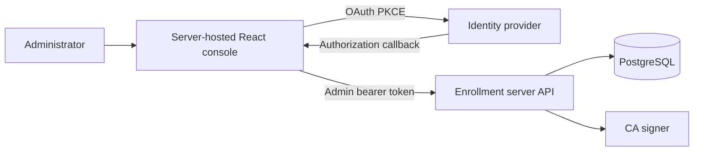

# Enrollment administration architecture

The enrollment server embeds one React administration console at `/admin/`. There is no separate native administrator application or legacy static interface. Vite on port `1430` is development tooling for the same source and proxies the same API.

## Browser client

React under `src/` owns OAuth PKCE, authenticated API calls, navigation, presentation, filtering, confirmation state, and transient action feedback. It receives only enrollment metadata exposed by the administrator API:

- Stable user subject.
- Enrollment and device identifiers.
- Public-key fingerprint.
- Enrollment status and timestamps.

It receives the administrator access token after the OAuth code exchange and keeps it in tab-scoped `sessionStorage`. It never receives CSRs, certificate chains, private keys, or signing material.

## Ownership boundary

The console manages enrollment-authority records only. Agent Gateway remains responsible for request routing, inference policy, provider credentials, and request-level telemetry. The console never displays prompts or responses.

Future organization and invitation workflows may live in this central console and enrollment service. The service stores one narrow desired Allow/Deny policy for the five known agent IDs, but does not compile, distribute, or enforce it. Inference rules, guardrails, routing, limits, and credentials remain Agent Gateway-native. Employee installers and organization bootstraps contain no policy or provider credentials.
