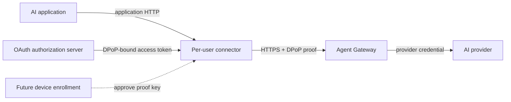

# Managed Identity Contract v1

Status: superseded as the production direction by [Managed mTLS identity contract v1](managed-mtls-v1.md). The DPoP implementation and fixtures remain experimental compatibility work; external OAuth-provider DPoP support is no longer a production prerequisite.

New contributors should not use this document as the implementation roadmap. Start with [CONTRIBUTING.md](../../CONTRIBUTING.md), then use the mTLS and session-forwarding contracts for current managed work. Change this file only when maintaining the retained DPoP fixtures or recording why the superseded design differs.

This contract defines managed user identity and proof that requests originate from the connector instance that obtained the token. It applies to managed remote mode only. Standalone mode does not use organizational identity.

The first increment provides verified user identity plus connector-instance proof. It must not claim verified organizational device identity. Device enrollment that associates the proof key with an approved device is a managed-release requirement and a fast follow to the first DPoP request. The executable draft enrollment API is specified in [Device enrollment API v1 draft](device-enrollment-v1.md).

## Security properties

A conforming request has all of these properties:

- The user authenticated through OAuth 2.0 Authorization Code with PKCE.
- The connector presents a short-lived DPoP-bound JWT access token for the current user.
- The connector signs a fresh DPoP proof with the key bound to that token.
- Agent Gateway validates the token, proof, and binding before constructing policy context.
- Agent Gateway removes connector credentials before provider routing.
- A connector connection or tunnel is never shared by different local users.

A local username, executable name, source IP, device-ID header, or unverified JWT claim is not identity under this contract. A DPoP key proves possession by one connector instance; it becomes device identity only after enrollment associates it, or a platform-backed replacement key, with an approved device.

## Trust boundaries



The application-facing listener runs in the logged-in user's session. The application does not receive the OAuth token, refresh credential, DPoP private key, or provider credential.

The connector is trusted to hold user credentials, but its asserted identity fields are not trusted. Agent Gateway derives user identity only from validated cryptographic material. Until enrollment is implemented, policy may authorize the verified user and connector key but must not represent that key as an organizationally verified device.

## OAuth client

The connector is a public native client and uses Authorization Code with PKCE as specified by RFC 8252:

- `S256` is the only accepted PKCE transformation.
- The redirect uses an ephemeral loopback port.
- The system browser performs user authentication.
- Device Authorization Flow is deferred.
- Client secrets are not embedded in or distributed with the connector.

The initial request uses the minimum API scope required by Agent Gateway. `openid`, profile, email, and `offline_access` are requested only when a concrete feature requires them. Policy identity uses the stable pair `(iss, sub)`, not email. A tenant claim is unnecessary because each customer deploys and configures its own Agent Gateway and issuer trust.

## DPoP key and storage

The connector generates a P-256 key and signs DPoP proofs with `ES256`. Its RFC 7638 JWK thumbprint identifies the connector-instance key.

Credential storage is selected during setup:

| Mode | Behavior |
| --- | --- |
| `auto` | Use Linux Secret Service when its write/read/delete preflight succeeds; otherwise use the protected file store. |
| `secret-service` | Require Linux Secret Service and fail setup when its preflight fails. This is strict mode. |
| `file` | Explicitly use the protected file store. |

The configured value is exposed as `--credential-storage auto|secret-service|file` and `AGENTDESKTOP_CREDENTIAL_STORAGE`. Setup persists the selected backend. Runtime never silently changes from Secret Service to file storage.

The file store uses an owner-only `0700` directory and owner-only `0600` files, performs atomic replacement without following symbolic links, verifies ownership and permissions before every read, and refuses unsafe paths. Records are scoped by operating-system user, exact issuer, and Agent Gateway authority. File storage relies on operating-system permissions; it does not protect against root or compromise of the same user account.

Setup validates storage before opening a browser. Secret Service preflight writes, reads, and deletes a temporary value. File preflight validates the directory and an atomic temporary write. Strict mode fails setup with an actionable error when Secret Service is unavailable. Startup revalidates the persisted backend and fails closed when it becomes unavailable or unsafe. Secrets never appear in logs, command-line arguments, or environment variables.

## User token

The connector sends the current user's access token on each managed HTTP request:

```http
Proxy-Authorization: DPoP <access-token>
DPoP: <signed-proof>
```

For transparent capture, both headers are carried on the outer HBONE or HTTP/2 `CONNECT` request. They are never inserted into the captured inner byte stream.

`Proxy-Authorization` is used so the connector does not overwrite the application's end-to-end `Authorization` or provider-shaped authentication headers. The connector removes application-supplied `Proxy-Authorization` and `DPoP` values at its application-facing boundary before adding its credentials. Agent Gateway treats these headers as private proxy authentication, not application metadata.

The v1 access token is a signed JWT with these required claims:

| Claim | Requirement |
| --- | --- |
| `iss` | Exact configured authorization-server issuer. |
| `aud` | Contains the Agent Gateway managed-edge audience. |
| `sub` | Stable organizational user identifier within `iss`. Canonical user identity is the pair `(iss, sub)`. |
| `exp` | Short expiration; rejected after expiry with configured clock skew. |
| `iat` | Issuance time; rejected when unreasonably in the future. |
| `jti` | Unique token identifier for audit and targeted revocation. |
| `cnf.jkt` | RFC 7638 thumbprint of the public DPoP key. |

Agent Gateway uses an explicit algorithm allowlist and validates signature, exact issuer, audience, lifetime, and required claims. It rejects untrusted key URLs or embedded token keys. An ID token is not an access token and must not be used as the connector credential.

## DPoP proof

For every ordinary managed HTTP request, the connector creates a fresh proof containing `typ: dpop+jwt`, `alg: ES256`, the public JWK, `htm`, `htu`, `iat`, a random unique `jti`, and `ath`, the base64url SHA-256 digest of the access token. It includes the latest gateway nonce when nonce use is enabled.

Agent Gateway validates the proof signature, method, configured public target URI, freshness, access-token hash, replay uniqueness, and equality of the proof-key thumbprint with `cnf.jkt`. Untrusted forwarding headers do not determine `htu`.

## Agent Gateway policy context

Agent Gateway constructs policy context only after transport and token validation succeeds:

| CEL value | Verified source |
| --- | --- |
| `jwt.iss` | Validated access-token `iss`. |
| `jwt.sub` | Validated access-token `sub`. |
| `jwt.jti` | Validated access-token `jti`. |
| `source.dpopJkt` | Validated DPoP proof-key thumbprint. |

Other validated JWT claims may remain available under `jwt`, but policy must not use raw connector headers as identity. `source.dpopJkt` is connector-instance proof in the initial increment. After enrollment, Agent Gateway may expose a separately named verified device identity derived from the enrollment record.

Authorization can revoke or deny the user, enrolled device, or combination. Agent Gateway remains the sole policy enforcement component.

### HTTP and tunnel scope

For ordinary managed HTTP, Agent Gateway validates the DPoP-bound token and a fresh proof independently on every request.

For transparent capture, Agent Gateway validates the DPoP-bound token and proof when accepting each outer `CONNECT` stream. It attaches the resulting verified identity to that tunnel as immutable internal metadata. Inspected inner requests inherit this metadata and must not reconstruct, replace, or shadow it using inner headers. The token and proof are not present on each inner request.

Trusted outer-to-inner identity propagation remains a requirement of this superseded design. The selected mTLS contract now has an end-to-end managed-capture walkthrough proving that inner application headers cannot override verified tunnel identity.

## Credential stripping

Agent Gateway consumes and removes `Proxy-Authorization` and `DPoP` immediately after credential extraction and before routing, policy extensions, transformations, mirroring, retries, telemetry, or construction of any upstream request. Only validated claims and immutable internal identity metadata proceed.

Agent Gateway must:

1. Prevent the raw token and DPoP proof from appearing in provider headers, CEL, transformations, policy extensions, mirrors, access logs, traces, or error bodies.
2. Strip any connector-only identity metadata introduced by future versions.
3. Apply Agent Gateway's normal policy and provider authentication.

For transparent capture, the outer credential is never inserted into or exposed through the inner request. No passthrough mode may opt this credential back into an egress path.

Application authentication headers continue to follow the configured Agent Gateway policy. The connector does not remove or replace provider-shaped application headers in v1; Agent Gateway owns that boundary.

Sensitive header redaction is defense in depth, not a substitute for stripping. Tests must inspect the mock provider's complete received headers and prove that connector identity credentials are absent.

## Session and connection isolation

The connector runs the application-facing endpoint in a user session. Credential state is scoped by operating-system user, exact issuer, and Agent Gateway authority.

Managed HTTP connection pools and HBONE pools are keyed by at least:

- Identity contract version.
- Authorization-server issuer.
- User `sub`.
- DPoP JWK thumbprint.
- Managed Agent Gateway authority.
- Credential generation, incremented by login, logout, and credential rotation.

A connection or tunnel created for one key must not serve another key. Login, logout, user switching, DPoP key rotation, or identity revocation drains affected pools before new traffic is admitted.

Each ordinary HTTP request carries its short-lived token and a fresh proof. Connection reuse does not replace per-request authentication. Each captured TCP flow has its own authenticated `CONNECT` stream.

## Fail-closed responses

TLS failures occur before HTTP and are reported locally by the connector as a managed connectivity or TLS error. The connector never retries directly to the provider.

After TLS succeeds, Agent Gateway returns a stable status and machine-readable error code. Because the credential is proxy authentication, missing or invalid credentials use `407 Proxy Authentication Required` with `Proxy-Authenticate: DPoP`. The connector consumes this challenge and translates it for the application; it does not forward the challenge as though the application could authenticate to the managed gateway.

| Status | Code | Meaning |
| --- | --- | --- |
| `407` | `identity_token_missing` | Connector user token is absent. |
| `407` | `identity_token_invalid` | Signature, issuer, audience, or required claims are invalid. |
| `407` | `identity_token_expired` | Token lifetime validation failed. |
| `407` | `dpop_proof_invalid` | Proof signature, fields, freshness, or token binding failed. |
| `407` | `dpop_proof_replayed` | Proof `jti` was already accepted in the replay window. |
| `403` | `user_revoked` | Verified user is revoked. |
| `403` | `device_revoked` | Verified device is revoked. |
| `403` | `identity_not_authorized` | Verified identity is denied by Agent Gateway policy. |
| `503` | `identity_status_unavailable` | Required revocation or identity status cannot be established. |

The response body uses Agent Gateway's JSON error envelope:

```json
{
  "error": {
    "code": "device_revoked",
    "message": "managed device is revoked"
  }
}
```

The connector translates these into stable application-facing errors and may add `x-agentdesktop-error` with the same code. It must not expose token contents, proof details, policy expressions, issuer internals, or revocation-service responses.

Connectivity to the authorization server is not required for every request. If a token expires and refresh cannot complete, new requests fail closed locally. Existing requests are not replayed automatically.

## Required Agent Gateway work

Current Agent Gateway schemas expose potentially reusable custom JWT credential locations, JWT CEL context, HTTP CONNECT, and HBONE facilities. Their suitability is version-dependent and does not imply conformance. A version-pinned managed-edge implementation must:

- Validate DPoP-bound JWTs from `Proxy-Authorization`.
- Validate DPoP proofs and enforce `cnf.jkt` binding and replay protection.
- Produce the canonical user and connector-key policy context above.
- Propagate verified outer `CONNECT` identity into inspected inner requests as immutable metadata.
- Strip connector credentials before provider handling.
- Return the stable v1 error codes.
- Test ordinary HTTP and HBONE paths with the same identity semantics.

Focused Agent Gateway changes are allowed when these capabilities are absent. Connector-supplied identity headers or an unauthenticated identity-forwarding shim are not acceptable substitutes.

Until that work exists and is tested in Agent Gateway, managed identity is not complete and connector-provided identity headers must not be authorized.

## Versioning

`v1` identifies this complete semantic contract, not only a header layout. A deployment pins compatible connector and Agent Gateway versions through bootstrap configuration or MDM. Unknown or incompatible identity contract versions fail closed.

Changes to credential location, required claims, binding, canonical policy fields, or failure codes require a new contract version. Adding optional validated claims does not require a new version if v1 behavior remains unchanged.

## Delivery and release gates

The first development increment may require interactive login after restart. It is not release-ready.

Before managed mode is public:

1. Refresh tokens use rotation and reuse detection and are persisted in the selected credential store.
2. Restart restores a valid session or refreshes it without browser interaction.
3. The DPoP key is enrolled as an approved device identity, or replaced by an enrolled platform-backed key.
4. User and device revocation are independently enforced and tested.
5. Ordinary HTTP and outer `CONNECT` paths pass the same identity, stripping, isolation, and fail-closed tests.

Managed mode is experimental until these gates are complete.

## Acceptance tests

A v1 implementation must cover:

- Authorization Code with `S256` PKCE on an ephemeral loopback callback.
- Valid DPoP-bound user identity over ordinary managed HTTP forwarding.
- The same identity over authenticated HBONE `CONNECT`.
- Missing, malformed, expired, wrong-issuer, and wrong-audience tokens.
- Wrong-key, wrong-method, wrong-URI, wrong-token-hash, stale, and replayed DPoP proofs.
- Application attempts to inject `Proxy-Authorization` or `DPoP`.
- Revoked user and revoked device.
- Concurrent local users with no connection-pool or credential crossover.
- User logout and DPoP key rotation.
- Complete provider-header inspection proving credential stripping.
- Log and trace inspection proving tokens, proofs, and authorization headers are absent.
- Secret Service success, protected-file fallback, strict-mode failure, unsafe-file rejection, and persisted backend reuse.
- Refresh rotation, restart restoration, reuse detection, and authorization-server outage.
- Device enrollment and independent device revocation.
- Gateway, IdP-refresh, and revocation-service outages failing closed without provider fallback.

## Remaining deployment choices

OAuth implementation starts only after choosing:

- Authorization-server issuer and discovery behavior.
- Registered public-client ID and Agent Gateway audience.
- Exact public client ID, Agent Gateway audience, and minimal API scope.
- Whether refresh tokens are sender-constrained to the DPoP key and how rotation and reuse detection work.
- Allowed JWS algorithms, issuer/JWKS binding, key-source restrictions, token `typ`, exact audience and `azp` rules, `nbf`, maximum age and lifetime, clock skew, JWKS caching, key rotation, and outage behavior.
- Access-token lifetime, refresh margin, and logout endpoint behavior.
- Revocation source, cache freshness, maximum propagation delay, outage behavior, and whether confirmed revocation terminates active HTTP requests and HBONE streams.
- Whether targeted `jti` revocation is supported; otherwise `jti` remains audit-only.
- Enrollment authority and Linux platform-backed key support.
