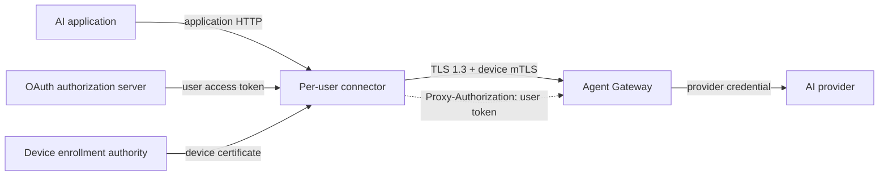

# Managed Identity Contract v1

Status: proposed contract for the first managed implementation. Neither the connector nor Agent Gateway implements this complete contract yet.

This contract defines how Agent Gateway obtains a cryptographically verified organizational user and device identity from laptop-originated traffic. It applies to managed remote mode only. Standalone mode does not use organizational identity.

## Security properties

A conforming request has all of these properties:

- The user authenticated through OAuth 2.0 Authorization Code with PKCE.
- The connector presents a device certificate over mutually authenticated TLS.
- The connector presents a short-lived JWT access token for the current user.
- The access token is bound to the presented device certificate.
- Agent Gateway validates both credentials and their binding before constructing policy context.
- Agent Gateway removes connector credentials before provider routing.
- A connector connection or tunnel is never shared by different local users.

A local username, executable name, source IP, device-ID header, or unverified JWT claim is not identity under this contract.

## Trust boundaries



The application-facing listener runs in the logged-in user's session. The application does not receive the OAuth token, refresh credential, device private key, or provider credential.

The connector is trusted to hold user and device credentials, but its asserted identity fields are not trusted. Agent Gateway derives identity only by validating cryptographic material against configured trust roots and issuers.

## Transport

The connector connects to the managed Agent Gateway using TLS 1.3 with a client certificate. Agent Gateway validates:

1. The complete client certificate chain against the deployment's device trust roots.
2. Certificate validity and key usage.
3. Revocation according to the deployment's configured certificate revocation mechanism.
4. A URI SAN containing the device's registered SPIFFE identity.

Device mTLS terminates at the Agent Gateway instance that validates the user token and constructs policy context. A load balancer must use TLS passthrough. Termination at an intermediary requires a separately versioned, cryptographically authenticated identity-forwarding contract and is outside v1.

The v1 device identity format is:

```text
spiffe://<organization-trust-domain>/agentgateway-edge/device/<device-id>
```

`<device-id>` is an enrollment-issued opaque stable identifier. Agent Gateway uses the validated URI SAN as the canonical device identity. It does not accept a connector-supplied device ID header.

The device private key must be non-exportable when the platform and enrollment method support it. The connector must not log or transmit the private key.

## User token

The connector sends the current user's access token on each managed HTTP request:

```http
Proxy-Authorization: Bearer <access-token>
```

For transparent capture, the same header is carried on the outer HBONE or HTTP/2 `CONNECT` request. It is never inserted into the captured inner byte stream.

`Proxy-Authorization` is used so the connector does not overwrite the application's end-to-end `Authorization` or provider-shaped authentication headers. The connector removes any application-supplied `Proxy-Authorization` value at its application-facing boundary before adding its own credential. Agent Gateway treats this header as private proxy authentication, not application metadata.

The v1 access token is a signed JWT with these required claims:

| Claim | Requirement |
| --- | --- |
| `iss` | Exact configured authorization-server issuer. |
| `aud` | Contains the Agent Gateway managed-edge audience. |
| `sub` | Stable organizational user identifier within `iss`. Canonical user identity is the pair `(iss, sub)`. |
| `exp` | Short expiration; rejected after expiry with configured clock skew. |
| `iat` | Issuance time; rejected when unreasonably in the future. |
| `jti` | Unique token identifier for audit and targeted revocation. |
| `tenant_id` | Stable organization or tenant identifier. |
| `cnf.x5t#S256` | Unpadded base64url encoding of the SHA-256 digest of the exact DER-encoded leaf client certificate, per RFC 8705. |

The authorization server issues the token only after proof of possession of the certificate's private key. Agent Gateway validates the JWT signature, issuer, audience, lifetime, and required claims. It decodes `cnf.x5t#S256` and compares the resulting 32 bytes in constant time with the SHA-256 digest of the exact leaf certificate used by the current TLS connection. It also verifies that the issuer, tenant, user, device SPIFFE identity, and enrollment record form an authorized relationship. Independently valid user and device credentials are insufficient.

Certificate rotation requires a newly bound access token. A token bound to an old leaf certificate is rejected on a connection using the replacement certificate.

Opaque access tokens and bearer tokens without `cnf.x5t#S256` do not conform to v1. An ID token is not an access token and must not be used as the connector credential.

## Agent Gateway policy context

Agent Gateway constructs policy context only after transport and token validation succeeds:

| CEL value | Verified source |
| --- | --- |
| `jwt.sub` | Validated access-token `sub`. |
| `jwt.tenant_id` | Validated access-token `tenant_id`. |
| `jwt.jti` | Validated access-token `jti`. |
| `source.identity` | Validated device SPIFFE URI SAN. |

Other validated JWT claims may remain available under `jwt`, but policy must not use raw connector headers as user or device identity. `source.connectHeaders` is client-supplied metadata and is not trusted merely because a field is present.

Authorization can revoke or deny the user, device, tenant, or combination. Agent Gateway remains the sole policy enforcement component.

### HTTP and tunnel scope

For ordinary managed HTTP, Agent Gateway authenticates the device-bound user token independently on every request.

For transparent capture, Agent Gateway authenticates the device certificate and user token when accepting each outer `CONNECT` stream. It attaches the resulting verified identity to that tunnel as immutable internal metadata. Inspected inner requests inherit this metadata and must not reconstruct, replace, or shadow it using inner headers. The token is not present on each inner request.

Trusted outer-to-inner identity propagation is required Agent Gateway work. Transparent managed capture is not conformant until an end-to-end test proves that inner application headers cannot override the verified tunnel identity.

## Credential stripping

Agent Gateway consumes and removes `Proxy-Authorization` immediately after credential extraction and before routing, policy extensions, transformations, mirroring, retries, telemetry, or construction of any upstream request. Only validated claims and immutable internal identity metadata proceed.

Agent Gateway must:

1. Prevent the raw user token and device certificate from appearing in provider headers, CEL, transformations, policy extensions, mirrors, access logs, traces, or error bodies.
2. Strip any connector-only identity metadata introduced by future versions.
3. Apply Agent Gateway's normal policy and provider authentication.

For transparent capture, the outer credential is never inserted into or exposed through the inner request. No passthrough mode may opt this credential back into an egress path.

Application authentication headers continue to follow the configured Agent Gateway policy. The connector does not remove or replace provider-shaped application headers in v1; Agent Gateway owns that boundary.

Sensitive header redaction is defense in depth, not a substitute for stripping. Tests must inspect the mock provider's complete received headers and prove that connector identity credentials are absent.

## Session and connection isolation

The connector runs the application-facing endpoint in a user session. Credential state is scoped by operating-system user and deployment tenant.

Managed HTTP connection pools and HBONE pools are keyed by at least:

- Identity contract version.
- Authorization-server issuer.
- Tenant ID.
- User `sub`.
- Device certificate thumbprint.
- Managed Agent Gateway authority.
- TLS trust and client-credential configuration.
- Credential generation, incremented by login, logout, and credential rotation.

A connection or tunnel created for one key must not serve another key. Login, logout, user switching, certificate rotation, or identity revocation drains affected pools before new traffic is admitted.

Each ordinary HTTP request still carries and validates its short-lived user token. Connection reuse does not replace per-request user authentication. Each captured TCP flow has its own authenticated `CONNECT` stream.

## Fail-closed responses

TLS failures occur before HTTP and are reported locally by the connector as a managed identity or TLS error. The connector never retries directly to the provider.

After TLS succeeds, Agent Gateway returns a stable status and machine-readable error code. Because the credential is proxy authentication, missing or invalid credentials use `407 Proxy Authentication Required` with `Proxy-Authenticate: Bearer`. The connector consumes this challenge and translates it for the application; it does not forward the challenge as though the application could authenticate to the managed gateway.

| Status | Code | Meaning |
| --- | --- | --- |
| `407` | `identity_token_missing` | Connector user token is absent. |
| `407` | `identity_token_invalid` | Signature, issuer, audience, or required claims are invalid. |
| `407` | `identity_token_expired` | Token lifetime validation failed. |
| `407` | `identity_binding_failed` | Token certificate binding does not match. |
| `403` | `user_revoked` | Verified user is revoked. |
| `403` | `device_revoked` | Verified device is revoked. |
| `403` | `identity_not_authorized` | Verified identity is denied by Agent Gateway policy. |
| `503` | `identity_status_unavailable` | Required revocation or identity status cannot be established. |

The response body uses Agent Gateway's JSON error envelope:

```json
{
  "error": {
    "code": "device_revoked",
    "message": "managed device is revoked"
  }
}
```

The connector translates these into stable application-facing errors and may add `x-agentgateway-edge-error` with the same code. It must not expose token contents, certificate details, policy expressions, issuer internals, or revocation-service responses.

Connectivity to the authorization server is not required for every request. If a token expires and refresh cannot complete, new requests fail closed locally. Existing requests are not replayed automatically.

## Required Agent Gateway work

Current Agent Gateway schemas expose potentially reusable custom JWT credential locations, downstream client-certificate validation, JWT CEL context, HTTP CONNECT, and HBONE mTLS facilities. Their suitability is version-dependent and does not imply conformance. A version-pinned managed-edge implementation must:

- Validates JWTs from `Proxy-Authorization`.
- Exposes the validated client certificate thumbprint to token-binding validation.
- Enforces `cnf.x5t#S256` binding.
- Produces the canonical user and device policy context above.
- Propagates verified outer `CONNECT` identity into inspected inner requests as immutable metadata.
- Strips connector credentials before provider handling.
- Returns the stable v1 error codes.
- Tests ordinary HTTP and HBONE paths with the same identity semantics.

Until that work exists and is tested in Agent Gateway, managed identity is not complete and connector-provided identity headers must not be authorized.

## Versioning

`v1` identifies this complete semantic contract, not only a header layout. A deployment pins compatible connector and Agent Gateway versions through bootstrap configuration or MDM. Unknown or incompatible identity contract versions fail closed.

Changes to credential location, required claims, binding, canonical policy fields, or failure codes require a new contract version. Adding optional validated claims does not require a new version if v1 behavior remains unchanged.

## Acceptance tests

A v1 implementation must cover:

- Valid user and device identity over ordinary managed HTTP forwarding.
- The same identity over authenticated HBONE `CONNECT`.
- Missing, malformed, expired, wrong-issuer, and wrong-audience tokens.
- Token replay with a different valid device certificate.
- Revoked user and revoked device.
- Concurrent local users with no connection-pool or credential crossover.
- User logout and device-certificate rotation.
- Complete provider-header inspection proving credential stripping.
- Log and trace inspection proving tokens, authorization headers, and certificate material are absent.
- Gateway, IdP-refresh, and revocation-service outages failing closed without provider fallback.

## Step 4 decisions

OAuth implementation starts only after choosing:

- Authorization-server issuer and discovery behavior.
- Registered public-client ID and Agent Gateway audience.
- Required scopes and the source of `tenant_id`.
- Loopback callback address selection and browser-launch behavior.
- How the authorization server issues RFC 8705 certificate-bound access tokens for the enrolled device key.
- Whether refresh tokens are sender-constrained to the device key, how rotation and reuse detection work, and whether a public client is permitted refresh credentials.
- Linux secret-service API and behavior when no user secret service is available.
- Allowed JWS algorithms, issuer/JWKS binding, key-source restrictions, token `typ`, exact audience and `azp` rules, `nbf`, maximum age and lifetime, clock skew, JWKS caching, key rotation, and outage behavior.
- Access-token lifetime, refresh margin, and logout endpoint behavior.
- Revocation source, cache freshness, maximum propagation delay, outage behavior, and whether confirmed revocation terminates active HTTP requests and HBONE streams.
- Whether targeted `jti` revocation is supported; otherwise `jti` remains audit-only.
- Test IdP and certificate authority used for deterministic integration coverage.
