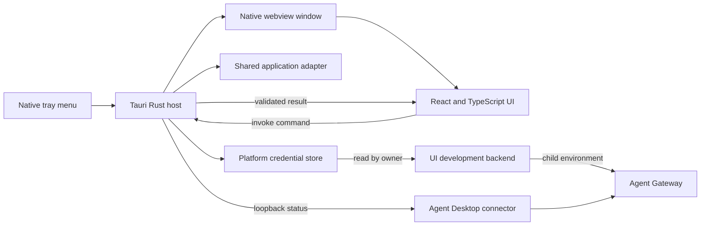

# Desktop UI architecture

Agent Desktop uses Tauri as a thin native shell around a React operational experience. The desktop UI is a separate per-user process from the connector and does not move gateway policy or traffic forwarding into the UI.

## Native host: Rust

Code under `src-tauri/` owns operating-system and trust-boundary behavior:

- System tray and native menu lifecycle.
- macOS accessory activation and Windows GUI-process behavior.
- Single-instance enforcement and window show, focus, hide, and quit behavior.
- Per-user desktop preference persistence.
- Provider credential storage through the native platform credential store.
- Read-only, redacted managed organization and device-credential status.
- Loopback connector status polling and tray-state updates.
- Safe application adapters shared from the root Rust library.
- Tauri commands exposed to the webview.
- Packaging, application identity, capabilities, and code-signing configuration.

The host currently exposes seven commands:

| Command | Purpose |
| --- | --- |
| `get_bootstrap` | Returns persisted settings plus native version and platform metadata. |
| `save_settings` | Persists desktop-owned window behavior. |
| `get_connector_status` | Reads and validates the connector's structured loopback status response. |
| `get_claude_status` | Inspects Claude Code installation and routing without changing files. |
| `get_managed_device_status` | Returns organization, session, enrollment, and public certificate metadata without credential material. |
| `open_managed_page` | Opens only the configured organization support page or enrollment administration console in the system browser. |
| `connect_claude` | Optionally stores a standalone provider key, then safely adds connector routing when no conflict exists. |

The host reuses the root crate only for narrow application-adapter and managed-identity status behavior. It does not start the forwarding runtime in-process. Managed status is projected into a redacted DTO; OAuth tokens, private keys, and certificate PEM are never serialized into the webview, and public device identifiers are omitted from bulk diagnostics. The UI-local development backend may supervise Agent Gateway: it polls the native credential store and injects the provider key into the child environment when the Gateway configuration references `$ANTHROPIC_API_KEY`. The key is never returned by a Tauri command or included in diagnostics. Future installed-service lifecycle or configuration operations belong behind narrow Rust commands or a local authenticated IPC/control API. The UI must not interpret Agent Gateway policy.

## Window UI: React and TypeScript

Code under `src/` owns presentation and interaction behavior:

- Operational views, controls, status feedback, and responsive layout.
- Polling presentation, navigation state, and save progress.
- Accessible labels, focus treatment, and user-facing errors.
- Typed wrappers around Tauri `invoke` calls in `src/backend.ts`.

React does not receive direct filesystem, process, credential-store, or unrestricted network access. It requests native work through the smallest command surface needed for the user workflow.

## Runtime flow

The native window uses WKWebView on macOS and WebView2 on Windows. Chromium and Node.js are not bundled with the application.

## Adding a feature

Keep purely visual state in React. Add a Rust command when a workflow needs native capabilities, sensitive data, persistent configuration, connector IPC, or validation that must not be bypassed. Return narrow serializable types and add only the Tauri capability permissions required by the window.
